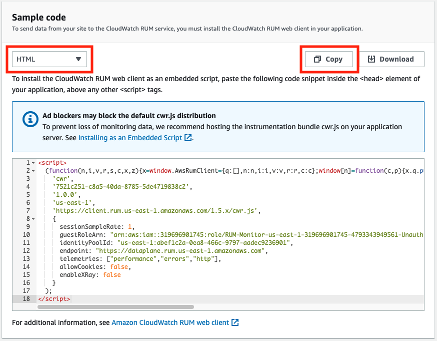

# 概要

本記事では、GitHub Pages で広く利用されている静的サイト作成ツール Jekyll と AWS の Web アプリケーションモニタリングツールである Amazon CloudWatch RUM を組み合わせたアクセス解析可能な静的サイトの構築方法をご紹介いたします。なお、ホスティング方法については触れません。

<!-- truncate -->

# Jekyll の準備

基本的には [Jekyll](http://jekyllrb-ja.github.io/) の公式サイトの手順をなぞる形になります。Jekyll のコマンドラインツールは gem (Ruby のライブラリ形式) で公開されていますので、手元の環境に Ruby が必要だということに注意してください。以下のコマンドを実行して、`jekyll` コマンドをインストールし、`hello-rum` というサイトを作成します。
```bash
gem install bundler jekyll
jekyll new hello-rum
cd hello-rum
```

公式の手順では次に `bundle exec jekyll serve` を実行していますが、筆者の手元の環境では `webrick` という gem が必要だというエラーが出ました。同様のエラーに遭遇した場合、Gemfile に以下の一文を追加してください。
```ruby
source "https://rubygems.org"

...省略...

# 末尾にこれを追加
gem "webrick"
```

最後に、以下のコマンドを実行して serve を開始します。
```bash
bundle install
bundle exec jekyll serve
```

[http://localhost:4000](http://localhost:4000) にアクセスし、正常に表示されていることを確認してください。

# Amazon CloudWatch RUM による App monitor の作成

[Amazon CloudWatch RUM](https://console.aws.amazon.com/cloudwatch/home#rum:dashboard?tab=overview) にアクセスし、右上の「Add app monitor」をクリックして App monitor の作成を開始します。

App monitor 名は「hello-rum」にします。Application domain は検証目的のため「localhost」にします。


集めるデータには全てチェックを入れます。不必要なものがある場合はチェックを外しても問題ありません。


「Allow cookies」のチェックは外しました。チェックを入れた場合は、cookie を設定してユーザーの動向を追跡できます。「Session samples」は 100% にします。「Data Storage」は有効にしました。これにより、CloudWatch Logs でデータを集計できるようになります。


作成が完了すると、組み込み用の Snippet が表示されます。TypeScript、JavaScript、HTML が選択できますが、Jekyll 用に「HTML」を選択します。右上から Snippet をコピーしてください。



# Jekyll に App monitor を組み込む

jekyll (バージョン 4.2.2) ではデフォルトで [minima](https://github.com/jekyll/minima) というテーマが適応されています。Snippet を組み込む `<head>` タグを上書きするため、`hello-rum` ディレクトリに `_includes` ディレクトリを作成し、その中に `head.html` を作成します。`head.html` の内容は以下にします。`<!-- ここに App monitor のスニペットを貼り付ける -->` は Snippet に置き換えてください。
```html
<head>
  <meta charset="utf-8">
  <meta http-equiv="X-UA-Compatible" content="IE=edge">
  <meta name="viewport" content="width=device-width, initial-scale=1">
  
  <link rel="stylesheet" href="{{ "/assets/main.css" | relative_url }}">
  

  <!-- ここに App monitor のスニペットを貼り付ける -->
</head>
```

上のコードはほとんど [minima の `_includes/head.html`](https://github.com/jekyll/minima/blob/master/_includes/head.html) の内容ですが、下部に App monitor のスニペットを組み込みます。また、minima のバージョンによっては [`_includes/custom-head.html`](https://github.com/jekyll/minima/blob/master/_includes/custom-head.html) も利用可能なようなので、そちらにスニペットを貼り付けても良いかもしれません。

[http://localhost:4000](http://localhost:4000) を何度かリロードしたり記事を閲覧したりして App monitor のダッシュボードにデータが表示されることを確認してください。成功していると以下のようにデータが表示されます。


# Production 環境への組み込み

前述した App monitor は localhost に設定した開発用のものでした。本番用の App monitor も組み込んでみます。前述した手順と同様に App monitor を作成してください。App monitor 名は「hello-rum-prod」にして、Application domain は本番環境で使うドメインに設定します。GitHub Pages の場合「`<org名>.github.io`」になります。他の設定は同じで問題ありません。Snippet はコピーしておいてください。

続いて、`head.html` を以下のように編集します。本番環境か否かを `` で判断しています。
```html
<head>
  <meta charset="utf-8">
  <meta http-equiv="X-UA-Compatible" content="IE=edge">
  <meta name="viewport" content="width=device-width, initial-scale=1">
  
  <link rel="stylesheet" href="{{ "/assets/main.css" | relative_url }}">
  

  
  <!-- ここに開発用 (localhost) の App monitor のスニペットを貼り付ける -->
  
  <!-- ここに本番用の App monitor のスニペットを貼り付ける -->
  
</head>
```

本番環境にデプロイしたあと、正常にデータが受信できることを確認してください。以上で全ての設定が完了です！

# おわりに

本記事では Jekyll で作成した静的サイトに Amazon CloudWatch RUM を組み込む手順を紹介しました。Amazon CloudWatch RUM ではページごとのアクセス状況やデバイス種別などのデータが解析可能ですし、CloudWatch Logs と連携させることにより、柔軟な集計を行うことも可能です。また、今回は Jekyll への組み込みを行いましたが、React や Vue.js などの SPA にも組み込むことは可能ですので、ぜひ一度お試しください。
