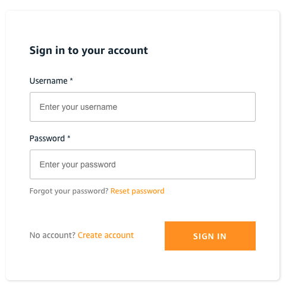
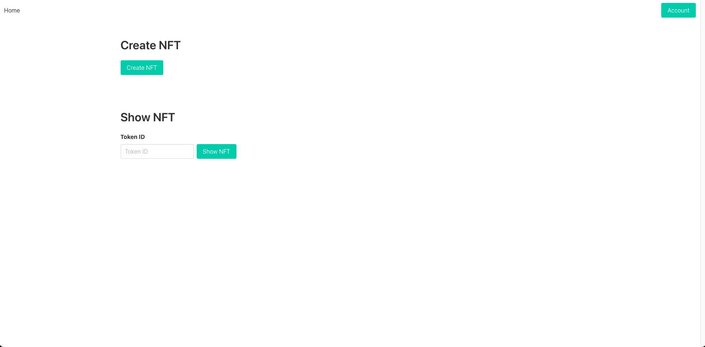
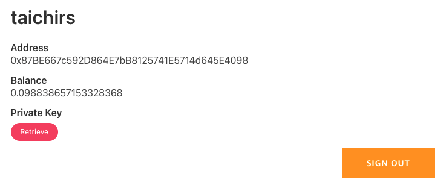
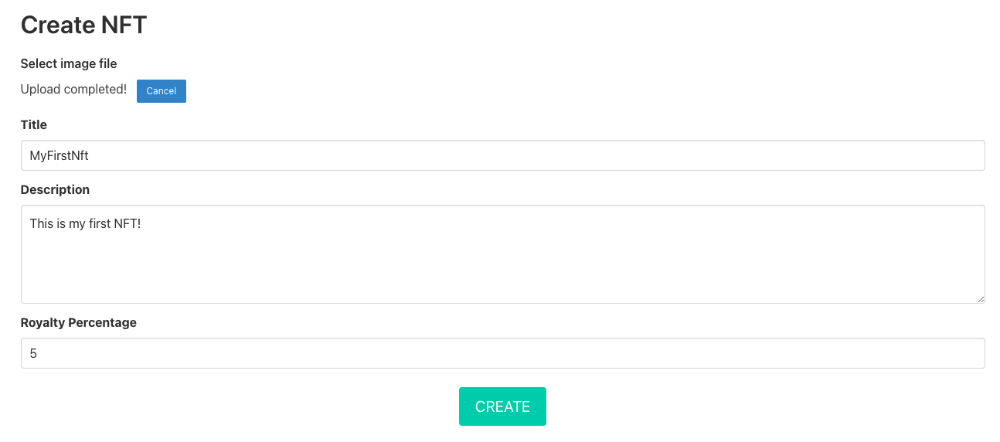
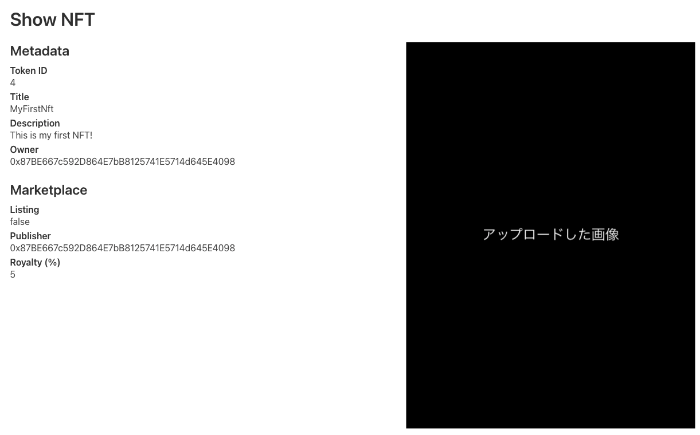
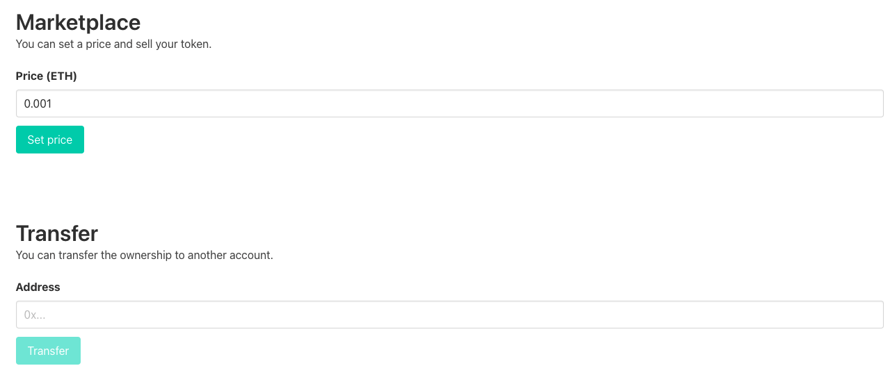
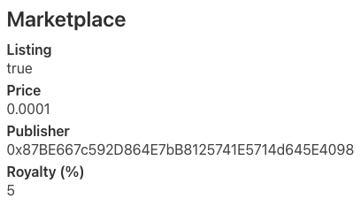
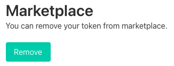
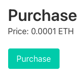
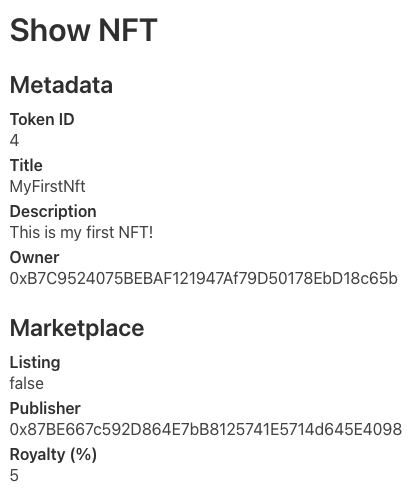

## 概要

本記事では、[github.com/aws-samples/simple-nft-marketplace](https://github.com/aws-samples/simple-nft-marketplace) というサンプルプロジェクトの動作をざっと確認してみたいと思います。Simple NFT Marketplace はその名の通り、シンプルな NFT のマーケットプレイスです。ただし、[OpenSea](https://opensea.io/) のように [MataMask](https://metamask.io/) と連携させた完全な非中央集権的なマーケットプレイスではなく、アカウント登録が必要で、かつ、ウォレットをシステム側で管理するマーケットプレイスです。ただ、ERC-721 の規格に則っていますので、Simple NFT Marketplace で作成した NFT を OpenSea に陳列するといったことも可能です。

<!-- truncate -->

## Simple NFT Marketplace の環境構築について

構築方法については [ドキュメント](https://github.com/aws-samples/simple-nft-marketplace/tree/main/docs/ja) をご参照ください。方法は 2 通り存在していて、1 つは deploy.js というスクリプトを利用した簡単な手順、もう一つは Step-by-Step で構築する手順です。**いずれの場合も Ethereum Ropsten の Ethereum が必要です。インターネット上のサービスを活用して、事前にトークンを取得しておいてください。「Ropsten Ethereum Faucet」などで検索すると見つかります。** (Ethereum Ropsten は Ethereum のテストネットです。Simple NFT Marketplace の Contract はデフォルトで Ropsten にデプロイされます。)

## 動作確認

では構築が完了した Simple NFT Marketplace にアクセスしてみます。まず、最初にサインイン/アカウント登録画面が表示されます。

初回なので、アカウントを作成しましょう。

アカウント登録が完了 or サインインが完了すると、トップページに遷移します。とてもシンプルな UI ですが、大きく 2 つの機能があることがわかります。1 つは NFT を作成する機能、もう 1 つは NFT を表示する機能です。後者の画面で NFT の売買も可能です。また、右上の Account ページでアカウント情報を確認できます。

こちらがアカウントページで表示されている情報です。ユーザー名 (taichirs)、ウォレットの Public Address、Balance (残高) が表示されています。Private Key は下部の Retrieve ボタンを押下すると表示されます。この Private Key は MetaMask などの外部ウォレットに Export することも可能です。また、サインアウトもここから行います。Private Key をユーザーに渡さない用に実装を変更すれば、サービス側で完全にウォレットを管理するということになります。

では Create NFT から最初の NFT を作成してみようと思います。Simple NFT Marketplace では、画像を NFT として登録する機能を提供しています。適当な画像をアップロードし、タイトルと説明を記入します。Royalty Percentage は、NFT の発行者に支払われるロイヤリティの設定です。例えばデフォルトの 5 %を設定した場合、NFT が売買されるたびに売買代金の 5 %が発行者に支払われます。ここで言う発行者は、売買する度に変わるオーナーとは別で、最初に NFT を作成したアカウントになります。発行者は NFT 作成後に変更できない仕様です。(変更できるように実装することも可能です。) 一通り入力したら CREATE ボタンを押下してください。暫く待つと、NFT の詳細ページに遷移します。

こちらが NFT の詳細ページです。Metadata として Token ID が払い出されています。Token ID は 1 から始まり、NFT が発行されるたびにインクリメントされる仕様です。Owner は今ログイン中のアカウントの Public Address になります。続いて Marketplace の情報です。Listing が false なので、現在この NFT は陳列されてません。(= 売買することができません。) Publisher (発行者) は Owner と同じアカウントで、Royalty は 5 %で設定されています。

下部にスクロールすると、Marketplace と Transfer の機能が使えます。前者は、値段を設定した上で Marketplace に NFT を陳列する機能です。後者は、売買とは別に、NFT を転送する (= Owner を変更する) 機能です。では、Marketplace の機能で、発行した NFT を陳列してみます。適当な Price を入力し、Set price ボタンを押下してください。

陳列が完了すると、Listing が true になり、Price が設定されていることが確認できます。この状態であれば、売買が可能です。

この状態で下部にスクロールすると、先程は値段を設定する UI だったところが、今度は陳列を取り下げる機能に変わっています。Remove を押下すると陳列を取り下げます。

では、NFT を購入してみます。別のアカウントでログインし、先程発行した NFT の詳細ページを開きます。下部にスクロールすると、Purchase という機能が表示されていると思います。Price を確認して、Purchase ボタンを押下してください。購入が完了すると、自動でページがリロードされます。なお、購入するアカウントの Balance が NFT の値段よりも多いことを事前に確認してください。

こちらが購入後の NFT の詳細ページの情報です。ご覧の通り、Owner のアドレスが変更されました。購入直後は陳列から外されるため、Marketplace の Listing は false になります。また前述したとおり、Publisher は変わっていないことを確認してください。

以上で売買を含む Simple NFT Marketplace の機能の紹介は終了です！

## おわりに

Simple NFT Marketplace では秘密鍵を DynamoDB で管理しています。AWS KMS を利用すると、システムの運用者ですら秘密鍵を取り出すことができなくなり、よりセキュアです。方法は以下をご参照ください。

- [How to sign Ethereum EIP-1559 transactions using AWS KMS](https://aws.amazon.com/jp/blogs/database/how-to-sign-ethereum-eip-1559-transactions-using-aws-kms/)
