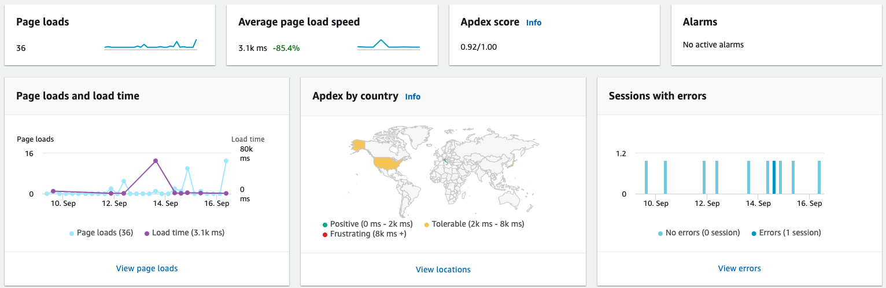
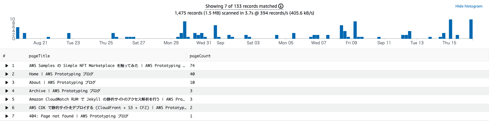

## 概要

本記事では、[Amazon CloudWatch RUM](https://console.aws.amazon.com/cloudwatch/home#rum:dashboard?tab=overview) を利用した月次アクセス数の集計方法を実際のコードと合わせて紹介します。

<!-- truncate -->

## Amazon CloudWatch RUM とは



Amazon CloudWatch RUM は、Web アプリケーションのモニタリングサービスです。簡単な JavaScript のスニペットをサイトに追加するだけで、ユーザーが使っているブラウザ、アクセス元の地域、パフォーマンスなどを取得し、可視化してくれます。利用方法は極めて簡単で、[Amazon CloudWatch RUM](https://console.aws.amazon.com/cloudwatch/home#rum:dashboard?tab=overview) のページを開き、右上の「Add app monitor」をクリックしてサイト名とドメイン名を入力すれば基本的な設定は完了です。**後述する集計を行う場合は「Data storage」を有効にしてログを出力するようにしてください。**テスト用のローカル環境であれば、ドメインは localhost で構いません。

作成するとスニペットが出力されるので、それをサイトに追加しましょう。追加された状態でサイトにアクセスし、Amazon CloudWatch RUM の Overview をご覧ください。「Page loads」などでアクセスが確認できれば正常に設定できています。

Jekyll で構成されたサイトの場合、次のように設定すれば本番環境と開発環境でスニペットを分けることができます。

```html
    
    <script>
      // 開発環境のスニペット
      (function(n,i,v,r,s,c,x,z){
      // ...省略...
          }
      );
    </script>
    
    <script>
      // 本番環境のスニペット
      (function(n,i,v,r,s,c,x,z){
      // ...省略...
          }
      );
    </script>
    
```

## マネージメントコンソールでの集計テスト

Amazon CloudWatch RUM にはさまざまな機能があるのですが、ここではログの集計にフォーカスします。月次にそれぞれのページにどれくらいアクセスがあったか投稿する Bot を作成しましょう。まずは [Amazon CloudWatch Logs](https://console.aws.amazon.com/cloudwatch/home#logsV2:log-groups) を開いて、該当の Log group を探します。Log group は `/aws/vendedlogs/RUMService_<サイト名><ランダム文字列>` の形式になっていますので、検索ボックスから探してみてください。さまざまな Event が記録されていると思います。以下に一例を示します。(一部の項目は無効な値に置き換えています。)

```json
{
    "event_timestamp": 1663290527000,
    "event_type": "com.amazon.rum.page_view_event",
    "event_id": "aaaaaaaa-aaaa-aaaa-aaaa-aaaaaaaaaaaa",
    "event_version": "1.0.0",
    "log_stream": "2022-09-15T18",
    "application_id": "aaaaaaaa-aaaa-aaaa-aaaa-aaaaaaaaaaaa",
    "application_version": "1.0.0",
    "metadata": {
        "version": "1.0.0",
        "browserLanguage": "en",
        "browserName": "Chrome",
        "browserVersion": "0.0.0.0",
        "osName": "Mac OS",
        "osVersion": "0.0.0",
        "deviceType": "desktop",
        "platformType": "web",
        "domain": "aws-samples.github.io",
        "title": "Home | AWS Prototyping ブログ",
        "pageId": "/jp-prototyping-blog/",
        "countryCode": "JP",
        "subdivisionCode": "13"
    },
    "user_details": {
        "sessionId": "00000000-0000-0000-0000-000000000000",
        "userId": "00000000-0000-0000-0000-000000000000"
    },
    "event_details": {
        "version": "1.0.0",
        "pageId": "/jp-prototyping-blog/"
    }
}
```

大事な項目をピックアップします。まず、event_timestamp にはイベントを受信した Unixtime が記録されています。次に、event_type が com.amazon.rum.page_view_event なので、ページを開いたというイベントであることがわかります。集計する際には event_type が com.amazon.rum.page_view_event のものをページごとに集計すれば良いことがわかります。metadata 以下にはユーザーのさまざまな情報が記録されています。

では、[Amazon CloudWatch の Logs Insights](https://console.aws.amazon.com/cloudwatch/home#logsV2:logs-insights) で集計してみようと思います。Log group に該当のものを選択し、Query を以下のように入力します。右上の集計期間内にログが存在しないと結果が正しく表示されない可能性があるため、注意してください。(不明な場合は、とりあえず最大の 4 weeks を選択してみてください。)

```
filter event_type = "com.amazon.rum.page_view_event"
| stats count(*) as pageCount by metadata.title as pageTitle
| sort pageCount desc
```

以下のような結果が出力されましたでしょうか。Home や About、404 などの結果も入ってしまっていますが、ここでは一旦アプリケーションレベルでフィルタリングすることにします。



では、この実行の流れをコードに落とし込みたいと思います。

## Python による集計

boto3 を利用して Query を実行します。まず、クエリ探索範囲の指定に Unixtime が必要です。ここでは約 1 ヶ月ということにします。

```python
import datetime

today = datetime.date.today()
month = today - datetime.timedelta(30)
```

これで今日と 1 ヶ月前の datetime が取得できました。あとは `strftime("%s")` によって Unixtime に変換できます。では boto3 の logs クライアントを初期化して、`start_query` を実行してみます。`<Log group名>` となっているところは置き換えが必要です。

```python
import boto3

client = boto3.client('logs')

query = client.start_query(
    logGroupName='<Log group名: 例 /aws/vendedlogs/RUMService_...>',
    startTime=int(month.strftime("%s")),
    endTime=int(today.strftime("%s")),
    queryString="""filter event_type = "com.amazon.rum.page_view_event"
    | stats count(*) as pageCount by metadata.title as pageTitle
    | sort pageCount desc""")

print(query)
```

正常に実行完了すると以下のように出力されます。

```
{'queryId': 'aaaaaaaa-aaaa-aaaa-aaaa-aaaaaaaaaaaa', 'ResponseMetadata': ... 省略 ...}
```

クエリの実行は非同期ですので、この queryId をポーリングすることにより実行結果を得ます。

```python
import time

while True:
    res = client.get_query_results(queryId=query['queryId'])

    if res['status'] != 'Running' and res['status'] != 'Scheduled':
        break

    time.sleep(1)

if res['status'] != 'Complete':
    print('status for the query was not Complete', res)
    exit(1)

print(res)
```

結果は以下のようになっていると思います。

```
{'results': [[{'field': 'pageTitle', 'value': 'ページタイトル'}, {'field': 'pageCount', 'value': '104'}],... 省略 ...]], 'statistics': {'recordsMatched': 193.0, 'recordsScanned': 2034.0, 'bytesScanned': 2139385.0}, 'status': 'Complete', 'ResponseMetadata': ... 省略 ...}
```

一つ一つの項目が `[{'field': 'field名', 'value': '値'}]` となっているのが少し扱いづらいので、これを `{ 'field名': '値' }` となるように変換します。

```python
def formatFields(fields):
    pageTitle = next(filter(lambda x: x['field'] == 'pageTitle', fields), None)
    pageCount = next(filter(lambda x: x['field'] == 'pageCount', fields), None)

    return {
        'title': pageTitle['value'],
        'count': pageCount['value'],
    }

print(list(map(formatFields, res['results'])))
```

これで出力が `[{ 'title': 'ページタイトル', 'count': '閲覧数' }...]` のようになりました。また、Home や About などのページを対象外にします。ここでは Python レベルでフィルタリングしていますが、Amazon CloudWatch RUM の設定でページを排除することも可能ですし、Amazon CloudWatch Logs Insigts のクエリで排除することもできます。

```python
# ページタイトルが Home, About, Archive, 404 で始まる物を対象外とする
def filterPosts(post):
    return (not post['title'].startswith('Home | ')) and \
        (not post['title'].startswith('About | ')) and \
        (not post['title'].startswith('Archive | ')) and \
        (not post['title'].startswith('404: '))

print(list(filter(filterPosts, map(formatFields, res['results']))))
```

以上で各ページの 1 ヶ月の閲覧数が取得できました！

## おわりに

あとはこれを Lambda 関数にして Slack に定期的に投稿するなどすれば、立派な集計 Bot の完成です！Lambda 化する場合は、十分な実行時間を確保できるタイムアウトに設定するのと、権限に注意してください。Lambda 関数から対象の CloudWatch Log Group に `logs:StartQuery` と `logs:GetQueryResults` が許可されている必要があります。
