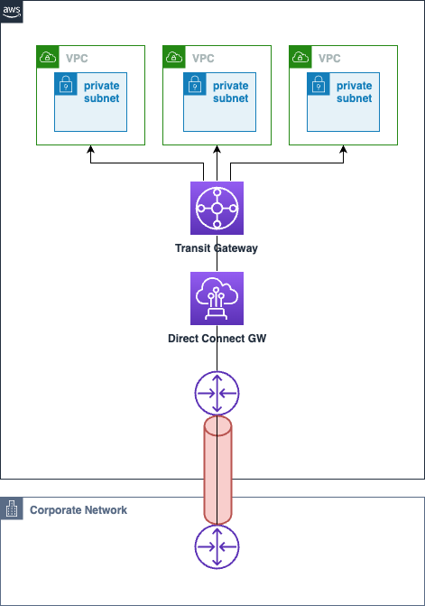
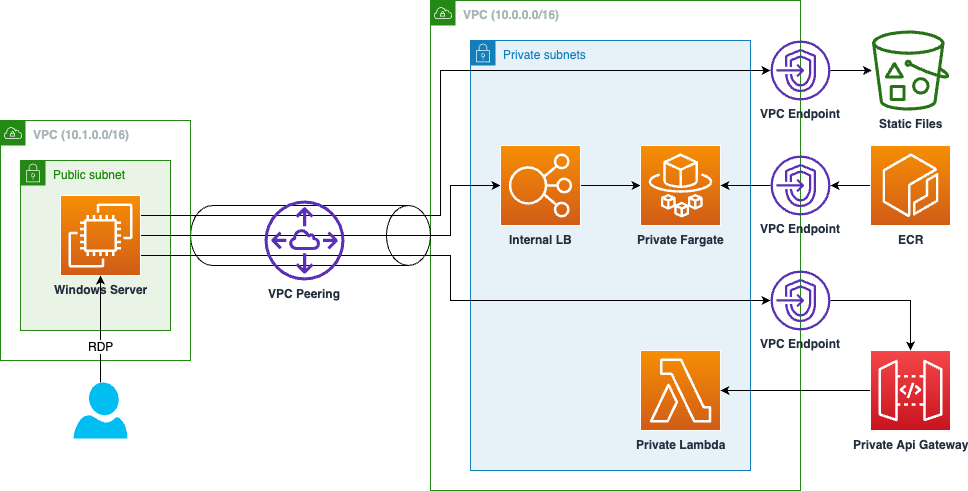

## はじめに

昨今、DX (Digital Transformation)に代表されるように、あらゆる業界・企業において IT 技術を駆使した業務変革のニーズが高まっています。その中で社内の変化を促すにあたり、既存の社内システムと連携が必要になるケースがあるかと思います。しかしこのような変革を担う部署では、PoC を実施し素早い成果創出を求められることが多い一方で、予算確保や保守・運用に関する社内調整が煩雑になり、スピード感を持って進めることが難しいと感じたご経験を持つ方もいらっしゃると思います。本記事は上記のような悩みを持っている方の助けになることを目指して執筆致しました。

<!-- truncate -->

## 背景

ゼロトラストによるセキュリティ対策が登場し久しいですが、多くのエンタープライズ企業ではまだ境界型セキュリティが主流であり、社内ネットワークと外部ネットワーク（例えばインターネットなど）の境界に、ファイアウォール等を設置しネットワークレイヤーでアクセス制限をかけているケースが多いと思います。特にプロキシを経由した社内ネットワークからインターネットへ出る outbound の通信は許可されている一方で、インターネットから社内イントラへの inboud は厳禁など、クライアントからインターネット経由でのサーバへのアクセスは許可されていないこともあるかと思います。このような制約があるため、既存の社内システム（ERP、Active Directory などの何らかの管理システム）と連携が必要なシステムを AWS 上に構築する場合、[AWS Direct Connect](https://aws.amazon.com/jp/directconnect/)による閉域環境を構成した上で、EC2 や RDS などを使い開発していくケースが多いかと思います。

一方 EC2 や RDS を使った PoC では、下記のような課題が発生することがあります。

- 料金：基本的に使用時間に基づいた課金のため、社内システムのようにアクセス量の比較的少ないシステムの場合、リクエスト数と実行時間で課金される[AWS Lambda](https://aws.amazon.com/jp/lambda/)などと比較し高くつくことがあります。PoC 予算は限られている傾向にあるため、これは PJ を進める上で障害となる可能性があります。
- 運用・保守：EC2 は各社社内ルールの規定上、従来の物理サーバやプライベートクラウドと同様の保守・運用プロセスが求められることがあります（参考：[責任共有モデル](https://aws.amazon.com/jp/compliance/shared-responsibility-model/)）。これは運用・保守人材確保のための社内調整や、人件費予算が必要となることを意味します。

上記のような課題は、サーバレス構成を採用することで解決が見込める一方、閉域網でのサーバレス構成に関する情報は散逸的であり、いざ開発に取り掛かると時間がかかったり、苦労することもあるかと思います。このため、参考となるようなサンプル：[serverless-application-on-closed-network](https://github.com/aws-samples/serverless-application-on-closed-network)を公開しました。下記にそのアーキテクチャを示します。

## アーキテクチャ

フロントエンド・バックエンド・RDB からなる典型的な３層構成を想定したアーキテクチャであり、フロントエンド (html/css/js)は S3 から配信、バックエンドは API Gateway + AWS Lambda の組み合わせを想定しています。フロントエンドは静的ファイルであり、SPA (e.g. React、Vue)を想定しています。 S3 および API Gateway は VPC Endpoint によりインターネットを経由せずにアクセスが可能です。なおバックエンドを Fargate 上で稼働するサンプルも併せて公開しているため、既存のアプリケーションがコンテナで稼働している場合はそのままお使いいただけます（※Fargate は稼働時間による課金である点はご留意ください）。なお簡便のため RDB は今回のサンプルの中に含めていません。

図中左側の VPC は Transit Gateway や VPC Peering によって接続された他 VPC のほか、Direct Connect によって接続された社内のイントラネットを想定した検証用環境です。アプリケーション稼働確認用の Windows Server を立ち上げるためだけに存在していますので、他環境にて確認できる場合は不要となります。デプロイおよび確認の詳細な手順については [Github のリポジトリ](https://github.com/aws-samples/serverless-application-on-closed-network)をご参照ください。

## おわりに

サーバレスコンピューティングは、従来かかっていた運用負荷を下げるための良い解法の一つです。人的資源の限られる中で変革を遂げるにあたり、ぜひ閉域ネットワーク内においても AWS のサーバレスな仕組みを積極的にご活用いただければ幸いです。
