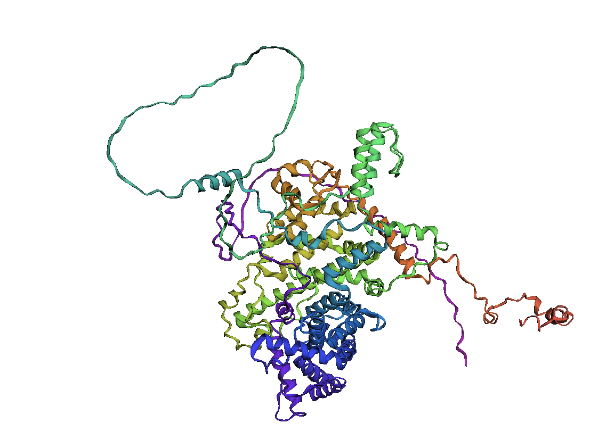

3dmol.js は分子を立体表示する JavaScript ライブラリです。React 環境で動作させる場合、少しコツが必要でしたので紹介します。
https://3dmol.csb.pitt.edu/doc/index.html



<!-- truncate -->

## React 環境で 3Dmol.js を読み込み分子データを可視化する手順

jQuery への依存を解決するために `3Dmol-min.js` を読み込みます。jQuery を読み込んだりバンドル時に解決する方法でも構いません。

```html
<!-- index.html -->
<script
  src="https://cdnjs.cloudflare.com/ajax/libs/3Dmol/1.4.0/3Dmol-min.js"
  integrity="sha384-G/ktMxNGQtSajNFY+7He9WGWTfkmMrPlEbZbCjtjWLYXpsgvuAkS8Aj8IBjs13yc"
  crossorigin="anonymous"
></script>
```

構造データ (pdb) のリンクを state にして、リンク取得時にレンダリングする hook を作成します。3Dmol viewer は構造データをテキストで渡すこともできますが、URL からダウンロードして表示する機能も備わっていますので、そちらを利用しています。

```tsx
// npm install 3dmol@^1.8.0
// @ts-ignore
import * as $3Dmol from '3dmol/build/3Dmol-nojquery.js'

export function Page() {
  const pdbViewer = useRef(null)
  const [pdbUrl, setPdbUrl] = useState('')

  useEffect(() => {
    const render = async () => {
      const viewer = $3Dmol.createViewer(pdbViewer.current)
      await $3Dmol.download(`url:${pdbUrl}`, viewer, {})
      viewer.setStyle({ cartoon: { color: 'spectrum' } })
      viewer.render()
    }
    if (pdbUrl) render()
  }, [pdbUrl])

  return <div ref={pdbViewer} style={{ height: 500, width: 500, position: 'relative' }}></div>
}
```

## Vite (Rollup) を利用している場合

3Dmol.js の内部で require を上書きしている箇所があり、その部分が `Illegal reassignment to import 'commonjsRequire'` と怒られてビルドに失敗します。利用していない箇所のため、下記のように rollup replace plugin でコードを書き換えてビルドすると回避できます。

```ts
import { defineConfig } from 'vite'
import react from '@vitejs/plugin-react'
// npm install @rollup/plugin-replace@^5.0.0
import replace from '@rollup/plugin-replace'

export default defineConfig({
  plugins: [
    replace({
      preventAssignment: true,
      include: 'node_modules/3dmol/build/3Dmol-nojquery.js',
      values: {
        'require = _3dmol_saved_require': '',
      },
    }),
    react(),
  ],
})
```
