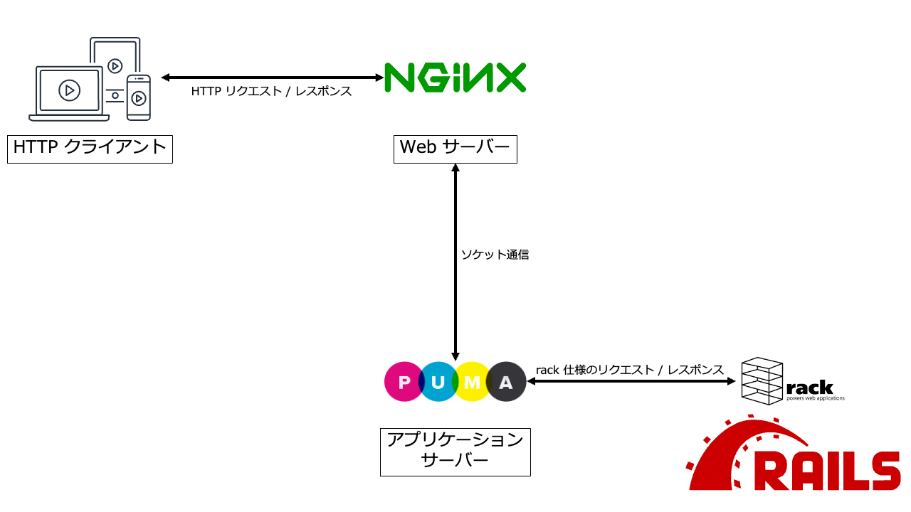
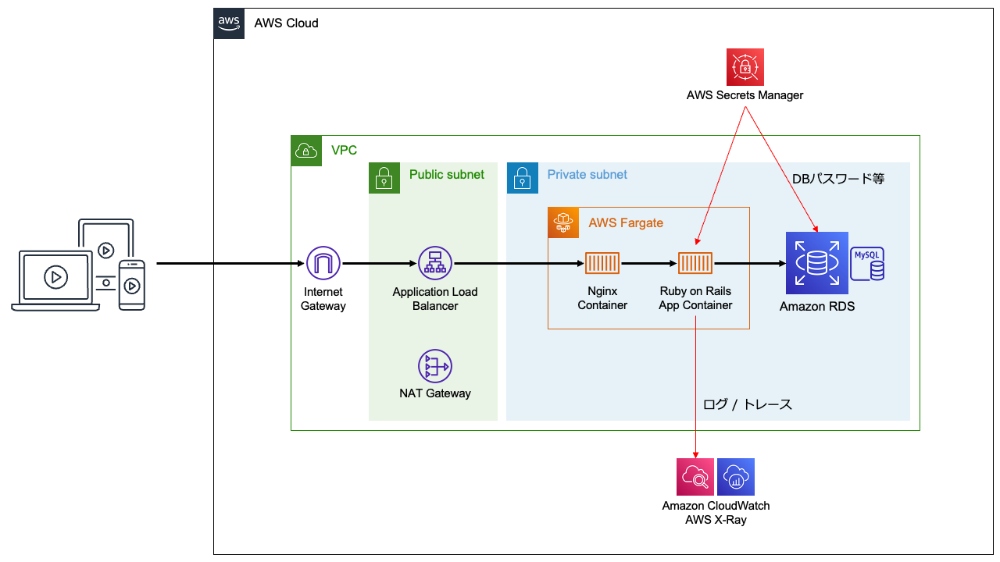
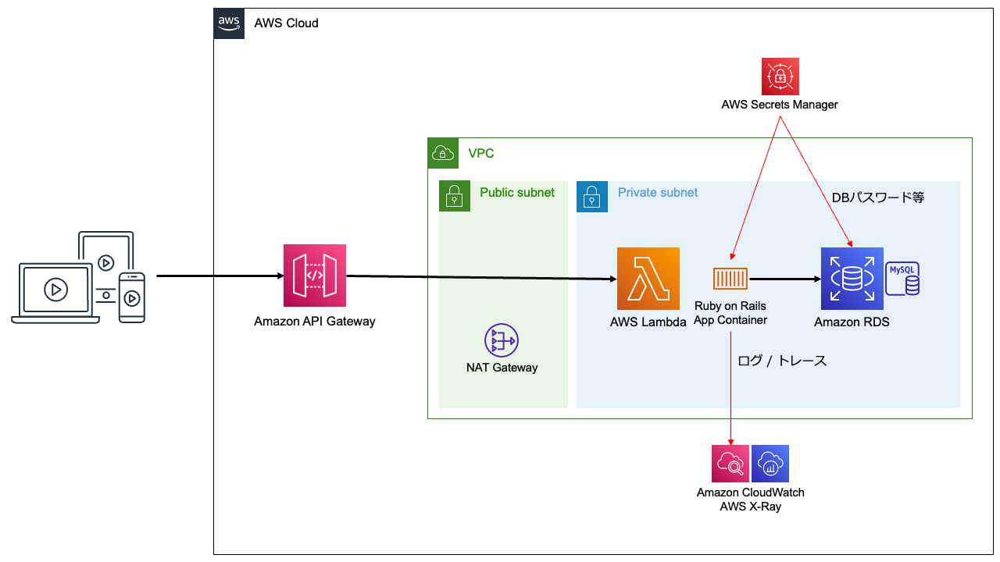
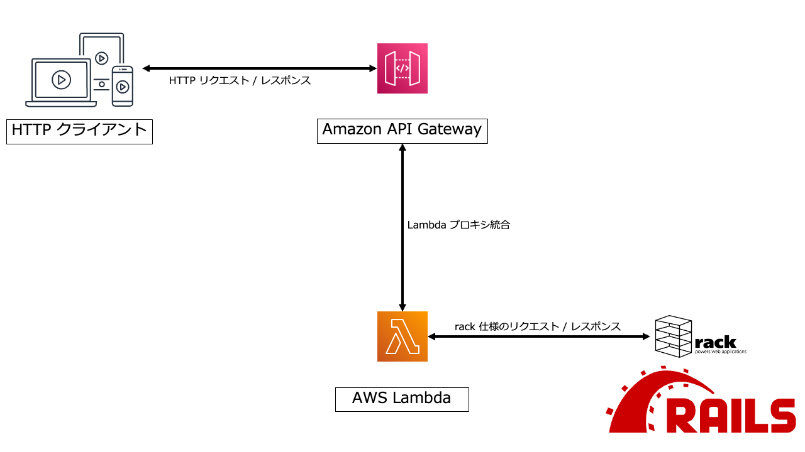

Ruby on Rails で開発された Web アプリケーションを AWS で稼働させる際、[EC2](https://aws.amazon.com/ec2/) の仮想サーバーや [ECS](https://aws.amazon.com/ecs/) のコンテナ環境で実行して [ALB](https://aws.amazon.com/elasticloadbalancing/application-load-balancer/) 等のロードバランサーで公開するのが一般的です。この方法は稼働時間に比例した料金となりますが、もう1つの選択肢として、時間ではなくリクエスト回数に応じた料金となる [API Gateway](https://aws.amazon.com/api-gateway/) と [Lambda](https://aws.amazon.com/jp/lambda/) を使う方法があります。今回は、Ruby on Rails を AWS Lambda で動かす方法を解説します。

<!-- truncate -->

## Ruby on Rails とは

Ruby on Rails は、Ruby 言語で Web アプリケーションを開発するためのフレームワークの1つです。「設定より規約 (Convention over Configuration, CoC)」というパラダイムの先駆者として有名で、他のフレームワークにも大きな影響を及ぼしました。

rails コマンドによるコードの自動生成機能が充実しており、プロジェクトの作成だけでなく、モデルやコントローラーの生成や認証機能の追加といった事まで行う事ができます。特に Active Record によるモデルとテーブル定義の自動生成は便利で、Web アプリ開発で必須となるデータベースアクセスを簡単に実装できます。

今回は、先日 aws-samples として公開された [AWS Lambda handler sample for Ruby on Rails](https://github.com/aws-samples/rails-lambda-handler) を元に、Ruby on Rails で実装された Web アプリを AWS Lambda で実行し、Amazon API Gateway で公開する方法とその仕組みについて解説します。

## Ruby on Rails による REST API の実装

[AWS Lambda handler sample for Ruby on Rails](https://github.com/aws-samples/rails-lambda-handler) では、Ruby on Rails で実装した Web アプリのサンプルを提供しています。この Web アプリは、Ruby on Rails の [API モード](https://railsguides.jp/api_app.html) を利用して実装したシンプルな Web API で、「Hello, World!」という固定データのみを持つ SQLite データベースに対してクエリーを行う事ができます。

まずは、このサンプルアプリについて簡単に解説します。

### サンプル Web アプリのモデル定義

モデルは以下のコマンドで生成し、テーブルを自動生成しています。

```
rails generate model Message text:string
```

これによって生成されたテーブル「`messages`」の定義は以下の通りです。

| カラム名      | 型        | 意味         |
| ------------ | -------- | ----------- |
| `id`         | integer  | メッセージ ID |
| `text`       | varchar  | メッセージ    |
| `created_at` | datetime | 作成日時      |
| `updated_at` | datetime | 更新日時      |

固定の SQLite データベースファイルには、以下のようなデータを格納しています。

| id | text          | created_at                 | updated_at                 |
| -- | ------------- | -------------------------- | -------------------------- |
| 1  | Hello, World! | 2022-12-15 01:31:59.291570 | 2022-12-15 01:31:59.291570 |

### サンプル Web アプリのコントローラー定義

コントローラーは以下のコマンドで生成しています。

```
rails generate controller Messages
```

生成されたコントローラー「[`MessagesController`](https://github.com/aws-samples/rails-lambda-handler/blob/main/rails/app/controllers/messages_controller.rb)」には、以下のアクションを実装しています。

| 名前     | ルート                  | 動作                         |
| ------- | ---------------------- | --------------------------- |
| `index` | `GET` /messages        | メッセージ一覧を返す            |
| `show`  | `GET` /messages/`{id}` | 指定された ID のメッセージを返す |

メッセージは以下のような JSON データとして返しています。

```
{
    "id": 1,
    "text": "Hello, World!",
    "created_at" :"2022-12-15T01:31:59.291Z",
    "updated_at": "2022-12-15T01:31:59.291Z",
    "url": "メッセージの URL"
}
```

### サンプル Web アプリの動作確認

[AWS Lambda handler sample for Ruby on Rails](https://github.com/aws-samples/rails-lambda-handler) をローカルに clone し、`rails` ディレクトリで以下のコマンドを実行する事により、ローカル環境で動作確認できます。

```
rails server
```

cURL 等のツールで `http://localhost:3000/messages` に GET リクエストを行うと、以下のようなレスポンスが返されます。

```
curl http://localhost:3000/messages

[{"id":1,"text":"Hello, World!","created_at":"2022-12-15T01:31:59.291Z","updated_at":"2022-12-15T01:31:59.291Z","url":"http://localhost:3000/messages/1"}]
```

## Ruby on Rails と Web サーバーの関係

Ruby on Rails において、Web サーバーへのリクエストが Web アプリで処理され、結果がレスポンスとして返されるまでの流れを簡単に解説します。



Ruby 言語では、Web アプリとアプリケーションサーバーとの間のインターフェイス仕様として [rack](https://rack.github.io/) が広く採用されています。Ruby on Rails はこの rack に準拠しており、標準アプリケーションサーバーとして [puma](https://puma.io/) が採用されています。puma は、Web サーバーが受け取った HTTP リクエストを rack 仕様に基づいて Web アプリに伝え、Web アプリが rack 仕様に基づいて生成したレスポンスを HTTP レスポンスとして Web サーバーに返します。

puma は、単体でも Web サーバーとして動作させる事が可能ではありますが、Web サーバー機能が使われるのはテスト用途が多く、本番環境ではよりパフォーマンスやスケーラビリティに優れた [nginx](https://nginx.org/) 等を利用するのが一般的となっています。(前節で `rails server` を実行した際は、puma を Web サーバーとしても利用した形となります)

## AWS で Ruby on Rails を動かす方法

Ruby on Rails で実装された Web アプリを AWS で稼働させる方法はいくつかありますが、今回は代表的な2パターンを紹介します。

### ALB + EC2 / ECS

最も一般的なのは、nginx や Ruby on Rails アプリを Amazon EC2 仮想マシンにインストールしたり、Amazon ECS で Docker コンテナ化として実行し、Application Load Balancer 等のロードバランサーで公開する方法です。



この方法は、Ruby on Rails の標準的な構成をほぼそのままクラウドに移行できるメリットがあります。料金は稼働時間に比例するため、常に一定以上の稼働率があるサービスに向いた方法になります。

### API Gateway + Lambda

そしてもう1つの方法が、AWS Lambda で Ruby on Rails アプリを実行し、Amazon API Gateway の Lambda プロキシ統合で公開する方法です。料金はリクエスト数に比例するため、稼働が特定の時間帯に集中するようなサービスに向いた方法になります。



AWS Lambda で Ruby on Rails を実行するには、Lambda 関数の実行環境の制約に合わせていくつかの設定変更が必要となります。また、API Gateway からは HTTP リクエストが Lambda 関数のパラメーターとして渡され、Lambda 関数の戻り値から HTTP レスポンスが生成されるため、それらを Ruby on Rails が理解できる rack 仕様に変換する処理も必要となります。



## Ruby on Rails を Lambda 関数化する

Ruby on Rails アプリを Lambda 関数化する方法には以下の2種類が存在します。

- [AWS Lambda の Ruby ランタイムを利用する](https://docs.aws.amazon.com/lambda/latest/dg/lambda-ruby.html)
- [コンテナイメージを作成する](https://docs.aws.amazon.com/lambda/latest/dg/ruby-image.html)

2022年12月現在、AWS Lambda の Ruby ランタイムが対応している Ruby 言語のバージョンは 2.7 のみのため、Ruby 3.0 以降を利用したい場合は独自のコンテナイメージを作成する必要があります。

本記事ではそれぞれの方法の詳細は割愛しますが、[Dockerfile のサンプル](https://github.com/aws-samples/rails-lambda-handler/blob/main/rails/Dockerfile)を提供していますので、独自のコンテナイメージを作成する際は参考にしてみて下さい。

### 環境変数の設定

Lambda 関数を作成したら、環境変数を設定します。Ruby on Rails の一般的な環境変数に加えて、Lambda 関数の実行環境では `/tmp` 以外のディレクトリに書き込む事ができないという制限に対応するための以下の設定が必要となります。

| 環境変数                   | 設定例        | 目的 |
| ------------------------- | ------------ | --- |
| `BOOTSNAP_CACHE_DIR`      | `/tmp/cache` | Rails アプリの起動高速化のためのキャッシュディレクトリを `/tmp` 以下に変更する |
| `RAILS_LOG_TO_STDOUT`     | `1`          | ログをファイルではなく標準出力に出力し、CloudWatch Logs で閲覧可能にする |

### ハンドラー関数の実装

Lambda 関数のエントリーポイントとなるのがハンドラー関数です。API Gateway からのリクエストとレスポンスを rack 仕様に変換して Ruby on Rails アプリを実行する処理は、ハンドラー関数で行う必要があります。

Amazon API Gateway には REST API と HTTP API があり、それぞれリクエストとレスポンスを Lambda 関数とやり取りするための入出力フォーマットが異なっています。それぞれの仕様へのリンクを以下に示します。

- REST API
  - [入力フォーマット](https://docs.aws.amazon.com/apigateway/latest/developerguide/set-up-lambda-proxy-integrations.html#api-gateway-simple-proxy-for-lambda-input-format)
  - [出力フォーマット](https://docs.aws.amazon.com/apigateway/latest/developerguide/set-up-lambda-proxy-integrations.html#api-gateway-simple-proxy-for-lambda-output-format)
- HTTP API
  - [入力フォーマット (2.0)](https://docs.aws.amazon.com/apigateway/latest/developerguide/http-api-develop-integrations-lambda.html#http-api-develop-integrations-lambda.proxy-format)
  - [出力フォーマット (2.0)](https://docs.aws.amazon.com/apigateway/latest/developerguide/http-api-develop-integrations-lambda.html#http-api-develop-integrations-lambda.v2)

#### rack の入出力仕様との相互変換

[AWS Lambda handler sample for Ruby on Rails](https://github.com/aws-samples/rails-lambda-handler) では、API Gateway の種類に応じて [rack の仕様](https://github.com/rack/rack/blob/main/SPEC.rdoc)に基づいた変換処理を行うハンドラー関数のサンプルを提供しています。

- [REST API 向けハンドラー関数 (lambda_rest.handler)](https://github.com/aws-samples/rails-lambda-handler/blob/main/rails/lambda_rest.rb)
- [HTTP API 向けハンドラー関数 (lambda_http.handler)](https://github.com/aws-samples/rails-lambda-handler/blob/main/rails/lambda_http.rb)

上記のコードを Ruby on Rails アプリのルートディレクトリにコピーし、Lambda 関数のハンドラー関数として設定すれば、Ruby on Rails アプリを Lambda 関数として実行する事ができます。

ハンドラー関数が行っている変換処理の概要は以下の通りです。

#### リクエスト対応表

REST API と HTTP API の入力パラメーターは、rack の env 変数に変換されます。

| rack の env 変数名 | 意味           | REST API | HTTP API |
| ----------------- | ------------- | -------- | -------- |
| `REQUEST_METHOD`  | HTTP メソッド  | `httpMethod` | `requestContext.http.method` |
| `SCRIPT_NAME`     | パスのルート    | 環境変数 `RAILS_RELATIVE_URL_ROOT` の値 | 環境変数 `RAILS_RELATIVE_URL_ROOT` の値 |
| `PATH_INFO`       | パス           | `path` | `requestContext.http.path` |
| `QUERY_STRING`    | クエリ文字列    | `multiValueQueryStringParameters` から再構築 | `rawQueryString` |
| `SERVER_NAME`     | ドメイン名      | `headers.X-Forwarded-Host`<br/>or `headers.Host` | `headers.x-forwarded-host`<br/>or `headers.host` |
| `SERVER_PORT`     | ポート         | `headers.X-Forwarded-Port` | `headers.x-forwarded-port` |
| `SERVER_PROTOCOL` | HTTP バージョン | `requestContext.protocol` | `requestContext.http.protocol` |
| `rack.url_scheme` | URL スキーム   | `headers.CloudFront-Forwarded-Proto`<br/>or `headers.X-Forwarded-Proto` | `headers.cloudfront-forwarded-proto`<br/>or `headers.x-forwarded-proto` |
| `rack.input`      | HTTP ボディ    | `body` | `body` |
| `CONTENT_LENGTH`  | ボディのサイズ  | `body` のサイズから計算 | `body` のサイズから計算 |
| `HTTP_COOKIE`     | Cookie データ  | `multiValueHeaders.Cookie` | `cookies` から再構築 |
| `HTTP_*`          | その他のヘッダー | `multiValueHeaders` | `headers` |

#### レスポンス対応表

rack のレスポンスは、REST API と HTTP API の出力パラメーターに変換されます。

| レスポンスの要素 | REST API | HTTP API |
| ------------- | -------- | -------- |
| ステータスコード | `statusCode` | `statusCode` |
| ボディ         | `body` | `body` |
| Cookie データ  | `multiValueHeaders.Set-Cookie` | `cookies` |
| その他のヘッダー | `headers`<br/>or `multiValueHeaders` | `headers` |

### サンプルを AWS で動かしてみる

[AWS Lambda handler sample for Ruby on Rails](https://github.com/aws-samples/rails-lambda-handler) では、冒頭で解説したサンプルアプリを API Gateway + Lambda 構成でデプロイする [AWS CDK](https://aws.amazon.com/jp/getting-started/guides/setup-cdk/) のサンプルも提供しています。

[サンプル Web アプリの動作確認](#サンプル-web-アプリの動作確認)を行った後、[AWS CDK のインストールと設定](https://aws.amazon.com/jp/getting-started/guides/setup-cdk/module-two/)を行った上で、`cdk` ディレクトリで以下のコマンドを実行するとデプロイが開始されます。

```
npm ci
npx cdk deploy -c railsMasterKey=d1c2ae419e40d2c43006aacdf98cf7f0
```

デプロイが終わると、以下のような出力が表示されます。

```
RailsLambdaStack.HttpHttpApiUrlE6BB121E = https://xxxx.execute-api.ap-northeast-1.amazonaws.com/
RailsLambdaStack.RestRestApiUrl2AB183B3 = https://yyyy.execute-api.ap-northeast-1.amazonaws.com/default/
```

後は、ローカルで起動した時と同じように動作確認して下さい。

```
curl https://xxxx.execute-api.ap-northeast-1.amazonaws.com/messages

[{"id":1,"text":"Hello, World!","created_at":"2022-12-15T01:31:59.291Z","updated_at":"2022-12-15T01:31:59.291Z","url":"https://xxxx.execute-api.ap-northeast-1.amazonaws.com/messages/1"}]
```

```
curl https://yyyy.execute-api.ap-northeast-1.amazonaws.com/default/messages

[{"id":1,"text":"Hello, World!","created_at":"2022-12-15T01:31:59.291Z","updated_at":"2022-12-15T01:31:59.291Z","url":"https://yyyy.execute-api.ap-northeast-1.amazonaws.com/default/messages/1"}]
```

## まとめ

今回は、[AWS Lambda handler sample for Ruby on Rails](https://github.com/aws-samples/rails-lambda-handler) のサンプルを中心に、Amazon API Gateway + AWS Lambda 環境で Ruby on Rails の Web アプリを稼働させるのに必要な技術的要素を解説しました。ユースケース次第では選択肢になり得ると思いますので、このような事が可能である事を覚えておいて頂ければと思います。
