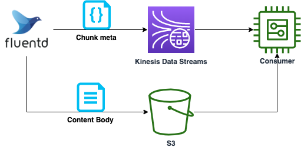
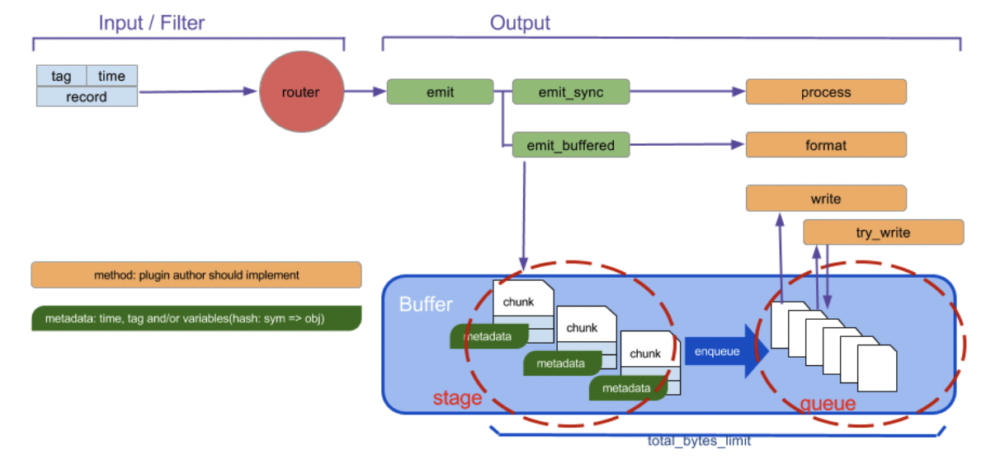

[Kinesis Data Streams](https://aws.amazon.com/jp/kinesis/data-streams/) には、１レコードのサイズは 1MB 以下でなければならない制約があり、サイズの大きいデータを転送するには工夫が必要となります。また利用料金はストリームに読み書きされるデータ量に基づいて決定されるため、サイズが大きいと課金額も増えてしまいます。本記事では Publisher が Fluentd の場合において、上記課題を解決する方法についてご紹介します。メッセージをメタデータと本体に分割し、本体は S3 経由で Consumer に渡し、メタデータのみを Kinesis Data Streams へ送ることで実現します。



<!-- truncate -->

## Kinesis Data Streams について

Kinesis Data Streams (以降 KDS と呼称) は、フルマネージドのサーバレスストリーミングサービスです。シンプルな従量制課金を採用しており、シャードの稼働時間に応じて料金は計算されます。シャードは基本的なスループットの単位であり、スループット要件に応じて必要なシャード数を決定します。なおオンデマンドモードを利用した場合、読み書きのデータ量に応じて自動的にシャード数のスケールが行われます。詳細は[Amazon Kinesis Data Streams の料金](https://aws.amazon.com/jp/kinesis/data-streams/pricing/)をご覧ください。  
また KDS では１レコードのサイズが 1MB 以下である必要があります。詳細は[Quotas and Limits](https://docs.aws.amazon.com/streams/latest/dev/service-sizes-and-limits.html)をご確認ください。

## 方針

各レコードにユニークな ID を割り当て、KDS では ID のみを、S3 バケットへはレコードの本体をそれぞれ送信します。バケットのオブジェクトキーに ID を含ませておけば、Consumer 側で ID を元にバケットから本体のデータを取得し処理することができます。これにより KDS で取り扱うレコードのサイズを削減することが可能です。以降、Fluentd を用いた場合について具体的に解説します。

## Fluentd のバッファリング

Fluentd ではレコードをバッファリングし、まとめて送信する機能があります。これによりログの欠損防止や流量の制御が可能です。本記事ではバッファリングの利用を前提とします。

Fluentd のバッファの仕組みを下記に示します。

[引用先](https://docs.fluentd.org/buffer)

バッファリングには stage と queue の 2 ステップが存在します。stage の段階でイベントの塊であるチャンク (chunk) を作成し、時間経過とともにエンキューされ、Output Plugin の指定する宛先へ送信されます。なおイベントはレコード (送信したいデータ本体)、タグ、タイムスタンプの 3 つの要素から構成されます。タグは Fluentd の備える主要な要素であり、Fluentd の内部でのルーティングに利用されます。Fluentd へデータを投入する Input Plugin はレコードにタグをつけ、Fluentd はそのタグにマッチする`match`ディレクティブを検索し、対応する Output Plugin へルーティングします。  
たとえば下記のような 2 つのダミーのデータソースがあるとします。それぞれタグは`example.hello`, `example.hoge`です。

```
<source>
  @type dummy
  dummy {"hello": "world"}
  tag example.hello
</source>

<source>
  @type dummy
  dummy {"hoge": "hoge"}
  tag example.hoge
</source>
```

上記両方ともに`example_bucket`という名前の S3 バケットへ転送したい場合、対応する match ディレクティブは下記のようになります。

```
<match example.**>
  @type s3
  s3_bucket example_bucket
</match>
```

それぞれ別のバケット (`hello_bucket`, `hoge_bucket`)へ転送したい場合は下記のように記述します。

```
<match example.hello>
  @type s3
  s3_bucket hello_bucket
</match>
<match example.hoge>
  @type s3
  s3_bucket hoge_bucket
</match>
```

詳細は[Config File Syntax](https://docs.fluentd.org/configuration/config-file)をご覧ください。

### チャンク

チャンクを作成するとき、[Chunk key](https://docs.fluentd.org/configuration/buffer-section#chunk-keys)と呼ばれるキーを指定しグルーピングすることができます。キーにはタグの他、タイムキーなどを含めることができます。  
例えば下記のように記述した場合、イベントは 60 秒ごと、かつタグごとにグルーピングされチャンクが作られます。

```fluent.conf
<buffer time, tag>
  timekey 60
</buffer>
```

チャンクを S3 へ転送する際、上記のチャンクに付与されたユニークな ID を KDS へ転送すれば Consumer 側で S3 のオブジェクトを取得できます。ユニークな ID は Output Plugin の[chunk.unique_id](https://docs.fluentd.org/plugin-development/api-plugin-output#chunk.unique_id)、Chunk key で利用したタグやタイムキーは[chunk.metadata](https://docs.fluentd.org/plugin-development/api-plugin-output#chunk.metadata)から取得することが可能です。

## Fluentd 自身のログをキャプチャする

チャンクのユニークな ID を KDS へ転送するには、Fluentd への入力として`chunk.unique_id`および`chunk.metadata`を与える必要があります。ここでは [Fluentd 自身のログをキャプチャする](https://docs.fluentd.org/deployment/logging#capture-fluentd-logs)方法を利用します。
Fluentd は Fluentd 自身のログを`fluent`タグをつけて管理しています。このログは`<label @FLUENT_LOG>`内で`match`ディレクティブを記載することで処理できます。たとえば下記のように記載すると、すべてのログレベルのログを KDS へ転送します。

```
<label @FLUENT_LOG>
  <match fluent.*>
    @type kinesis_streams
    ...
  </match>
</label>
```

Fluentd の S3 Output プラグインでは S3 転送時に`chunk.unique_id`および`chunk.metadata`を含んだログを[debug レベルで出力](https://github.com/fluent/fluent-plugin-s3/blob/2109abcaf6279fb92d0e877359d281aacba6b9ff/lib/fluent/plugin/out_s3.rb#L354)します。下記ログをキャプチャし KDS へ転送すれば、Consumer 側で S3 のオブジェクトキーを特定できます。

```out_s3.rb
log.debug "out_s3: write chunk #{dump_unique_id_hex(chunk.unique_id)} with metadata #{chunk.metadata} to s3://#{@s3_bucket}/#{s3path}"
```

## Fluentd のコンフィギュレーション

以上の内容を踏まえ、S3 へ本体を転送し、KDS へメタデータを送るコンフィギュレーションを作成します。

### ログレベルの設定

S3 Output プラグインは 前述のチャンク情報を含むログを `debug` レベルで出力するため、`system`セクションに下記のように設定します。[参考](https://docs.fluentd.org/deployment/logging#by-config-file)

```
<system>
  log_level debug
  <log>
    format json
    time_format %Y-%m-%d
  </log>
</system>
```

### S3

ここでは後に[Amazon Athena](https://aws.amazon.com/jp/athena/)を用い効率的にクエリできるよう、Hive 形式 (s3://year=yyyy/month=mm/day=dd) かつ gzip に圧縮し出力するものとします。  
下記のように設定すると、S3 バケットへは`s3://example_bucket/hello/year=2023/month=01/day=05/{チャンクID}.gzip`のような形式で保存されます。

```
<match example.hello>
    @type s3

    s3_bucket example_bucket
    s3_object_key_format ${tag[1]}/%{time_slice}/${chunk_id}.%{file_extension}
    store_as gzip

    time_slice_format year=%Y/month=%m/day=%d

    <format>
      @type json
    </format>

    <buffer time,tag>
        timekey 10s
    </buffer>
</match>
```

### フィルタリング

Fluentd の[Filter Plugins](https://docs.fluentd.org/filter)を使うと、送信したい内容を加工することができます。  
まず前述した S3 Output プラグインが S3 転送した時のログを下記の設定により抽出します。

```
  <filter fluent.debug>
    @type grep
    <regexp>
      key message
      pattern /out_s3: write chunk/
    </regexp>
  </filter>
```

続いて元のタグ (ここでは `example.hello`) を抽出し KDS のパーティションキーとして利用します。

```
  <filter fluent.debug>
    @type record_transformer
    enable_ruby
    <record>
      # 元のタグを正規表現で抽出しkinesisのpartition keyに利用
      partition_key ${record["message"].match(/tag=.+,/)[0]}
    </record>
  </filter>
```

`fluent.debug`タグのレコードは KDS へ送信したくないため下記により除外します。

```
  <filter fluent.debug>
    @type grep
    <exclude>
      key partition_key
      pattern /fluent.debug/
    </exclude>
  </filter>
```

### KDS

先ほど抽出した元のタグをパーティションキーに設定し KDS へ送信します。これにより同じタグのレコードは毎回同じシャードに送信され順序性が担保されます (KDS はシャード内でのみ順序を保証します)。

```
  <match fluent.debug>
    @type kinesis_streams
    stream_name example_stream

    partition_key partition_key
  </match>
```

以上の内容を一つにまとめたものが下記となります。

```fluent.conf
<system>
  log_level debug
  <log>
    format json
    time_format %Y-%m-%d
  </log>
</system>

<match example.hello>
    @type s3

    s3_bucket example_bucket
    s3_object_key_format ${tag[1]}/%{time_slice}/${chunk_id}.%{file_extension}
    store_as gzip

    time_slice_format year=%Y/month=%m/day=%d

    <format>
      @type json
    </format>

    <buffer time,tag>
        timekey 10s
    </buffer>
</match>

<label @FLUENT_LOG>
  <filter fluent.debug>
    @type grep
    <regexp>
      key message
      pattern /out_s3: write chunk/
    </regexp>
  </filter>
  <filter fluent.debug>
    @type record_transformer
    enable_ruby
    <record>
      partition_key ${record["message"].match(/tag=.+,/)[0]}
    </record>
  </filter>
  <filter fluent.debug>
    @type grep
    <exclude>
      key partition_key
      pattern /fluent.debug/
    </exclude>
  </filter>

  <match fluent.debug>
    @type kinesis_streams
    stream_name example_stream
    partition_key partition_key

    <buffer time>
      timekey 10s
    </buffer>
  </match>
</label>
```

## まとめ

本記事では Fluentd から Kinesis Data Streams へ大きなサイズのレコードを取り扱う具体的な方法例についてご紹介しました。ご参考にいただければ幸いです。
