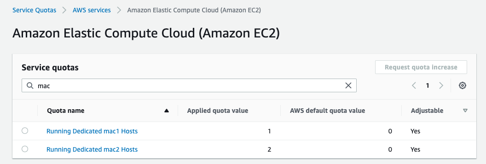
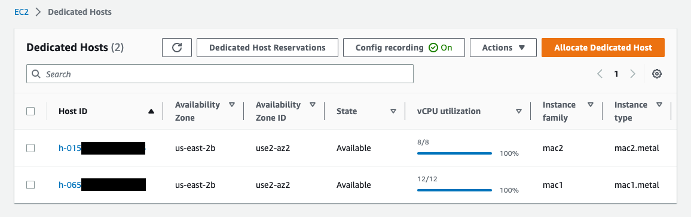
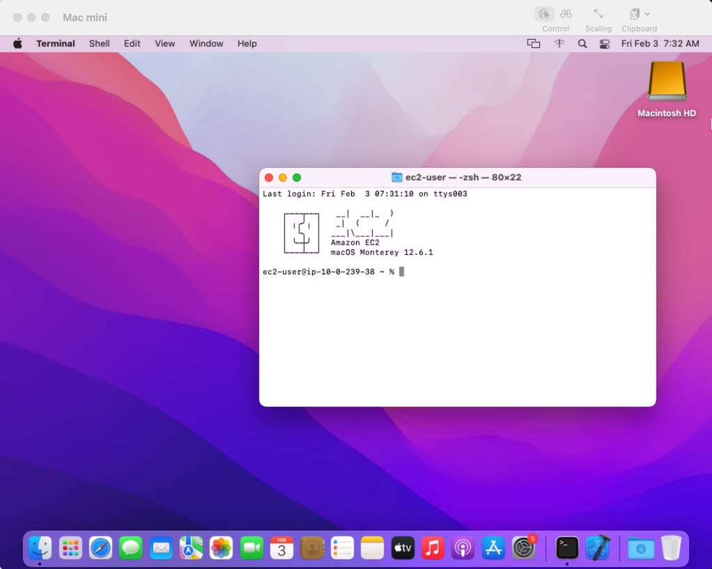

[EC2 Macインスタンス](https://aws.amazon.com/jp/ec2/instance-types/mac/)がGAされて久しいですが、まだまだAWSの中では新しいサービスということもあり、使うと驚くこともいくつかあります。
この記事では、実際にプロトタイピング案件でEC2 Macを使ってみて気づいたことを何点か紹介します。

<!-- truncate -->

## 起動にはクォータ緩和が必要
EC2 Macインスタンスはデフォルトでは起動できません。[コチラのページ](https://console.aws.amazon.com/servicequotas/home/services/ec2/quotas)からクォータの値を上限緩和しましょう。mac1がIntel Mac、mac2がM1 Macを指します。




## Dedicated hostを使う必要がある
よくあるユースケースのLinuxインスタンスではEC2インスタンスを直接起動できますが、Macインスタンスではそれができません。代わりに、Dedicated hostを割り当て、そのホスト上にインスタンスを起動する形になります。[具体的な方法はこちら](https://docs.aws.amazon.com/AWSEC2/latest/UserGuide/ec2-mac-instances.html#mac-instance-launch)。



また、課金についてもインスタンスを起動しているかどうかによらず、Dedicated host割当時間で決まります ([参考](https://aws.amazon.com/ec2/instance-types/mac/#Pricing))。使い終わったらインスタンスの終了だけでなくホストのリリースを忘れないようにしたいですね。

## Dedicated hostのリリースに関する制約
EC2 MacのDedicated hostは少しクセがあり、以下の制約があります:

1. ホストを割り当ててから24時間はリリースできません。これは Apple macOS Software License Agreement に準拠するためということです ([参考](https://aws.amazon.com/ec2/instance-types/mac/#Pricing))。
2. ホスト上のインスタンスを停止/終了してから1〜3時間程度は、ホストのリリースやインスタンスの起動ができません ([参考](https://docs.aws.amazon.com/AWSEC2/latest/UserGuide/ec2-mac-instances.html#mac-instance-stop))。内部SSDやNVRAMの消去、デバイスファームウェアのアップデートなどをするためとのことです。なお、この処理に要する時間はユーザーには課金されないようです。

いつでも自由にホストをリリースできるわけではないことに注意しましょう。特にDedicated hostやインスタンスをCloudFormationで管理する場合は、リソースの削除時にホストとインスタンスの削除が同時に行われないように工夫が必要です (Removal PolicyをRetainにする、別のスタックでデプロイするなど)。

## リモートデスクトップ接続する方法
Macインスタンスの操作は、やはりGUIが便利です。Apple Remote Desktopの機能を有効化すれば、お手元の端末からMacインスタンスへリモートデスクトップ接続が可能です。

具体的な方法はこちらに書かれています: [Connect to your instance using Apple Remote Desktop](https://docs.aws.amazon.com/AWSEC2/latest/UserGuide/ec2-mac-instances.html#connect-to-mac-instance)。Macインスタンス側の設定は、ユーザーにパスワードを設定し、ARDの機能を有効化するだけです。

ARDには5900番ポートでアクセスできます。[SSM Session manager](https://aws.amazon.com/jp/blogs/news/use-port-forwarding-in-aws-systems-manager-session-manager-to-connect-to-remote-hosts-jp/)を使えば、セキュリティグループの許可は不要で、またプライベートサブネットにあるインスタンスでもポートフォワードが可能です。

```sh
# targetにはMacインスタンスのインスタンスIDは入れる (マネジメントコンソールで確認)
aws ssm start-session \
    --target i-xxxxxxxxxxxxxx \
    --document-name AWS-StartPortForwardingSession \
    --parameters '{"portNumber":["5900"], "localPortNumber":["5900"]}'
```

あとは手元の端末のVNCクライアント (MacならScreen sharingアプリがデフォルトで利用可能です) から、`localhost:5900` に接続すればOKです。



画面解像度を変更したい場合は、こちらに手順があります: [Modify macOS screen resolution on Mac instances](https://docs.aws.amazon.com/AWSEC2/latest/UserGuide/ec2-mac-instances.html#mac-screen-resolution)。コマンド4つくらいで済みます。

## EBSサイズを変更する方法
Macインスタンスでも、メインストレージとしてEBSが利用されます。一点Amazon Linuxインスタンスと異なるのは、EBSサイズを変更する際にMac側から明示的にストレージを拡張するコマンドを実行する必要がある点です。[こちらのドキュメント](https://docs.aws.amazon.com/AWSEC2/latest/UserGuide/ec2-mac-instances.html#mac-instance-increase-volume)に詳細が書かれています。

また、コマンド実行の際にはインスタンスの再起動が必要なのですが、この再起動に数十分程度かかる場合がありました。ベターな方法として、[EC2のユーザーデータ](https://docs.aws.amazon.com/AWSEC2/latest/UserGuide/instancedata-add-user-data.html)でこのコマンドを実行すれば、再起動は不要になります。もし最初から必要なストレージサイズがわかっているのであれば、ユーザーデータ内で上記コマンドを実行することをおすすめいたします。

## まとめ
以上、EC2 Macインスタンスを使ってみて気づいたことを紹介しました。

プロトタイピングチームでは、EC2 Macを使ってJenkinsのUnityビルドパイプラインを構築するCDKテンプレートを公開しています。こちらもぜひご参考にしてください。
