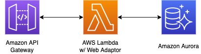

Lambda Web Adapter を利用することで、 コンテナイメージとして実装した Web システムを簡単に Lambda で動かすことができるようになります。  
この Lambda Web Adapter を利用して、 TypeScript の ORM ツールである Prisma を使用する際に注意すべきポイントがありましたので、そちらをご紹介します。

<!-- truncate -->

## Lambda Web Adapter について

[Lambda Web Adapter](https://github.com/awslabs/aws-lambda-web-adapter) とは、開発者が使い慣れた Web フレームワークをほぼそのまま AWS Lambda 上で実行することができるツールです。  
このツールを使うことで、コンテナ用に実装した Web アプリに変更を加えることなく、Lambda 上で実行させることができます。

Lambda Web Adapter については、弊チームメンバーが記載した [builders.flash の記事](https://aws.amazon.com/jp/builders-flash/202301/lambda-web-adapter/)にて具体的な使い方や性能面など詳しく紹介されていますので、こちらをご覧ください。

## Prisma について
[Prisma](https://www.prisma.io/) とは、Node.js の ORM ツールです。  
TypeScript に対応しており、型安全なデータベース操作、自動補完機能による効率の良いコーディングなどを実現することができます。  

## アーキテクチャ図

Lambda には、コンテナイメージで実装した以下の Web アプリをデプロイしています。
* ベースイメージ：[node:18.14-bullseye-slim](https://hub.docker.com/layers/library/node/18.14-bullseye-slim/images/sha256-1ce35098327311d9cb16504d10abf4d5644ecd181279655a5906bb7100c91606)
  * Prisma を動作させるために必要なので、Dockerfile 内で openssl をインストールしています。
  * `RUN apt-get -y install openssl`
* Web フレームワーク：[Express](https://expressjs.com/)

## Lambda Web Adapter と Prisma を利用する際の注意点
### Lambda 関数のアーキテクチャ不一致による実行エラー
こちらは、Prisma とは直接関係のないものとなりますが、ハマりやすいポイントのためご紹介します。  

Lambda 関数には、`arm64` アーキテクチャと `x86_64` アーキテクチャの2種類が用意されています（[参考](https://docs.aws.amazon.com/ja_jp/lambda/latest/dg/foundation-arch.html)）。  
Lambda 関数で利用するアーキテクチャとコンテナイメージのアーキテクチャが一致していない場合は、`exec format error` というエラーが発生し実行できません。  
Docker を利用してコンテナイメージをビルドする際は、`--platform` オプションを利用してアーキテクチャを一致させるようにしてください（[参考](https://docs.docker.com/build/building/multi-platform/#building-multi-platform-images)）。  

#### AWS CodeBuild を利用してコンテナイメージをビルドする際の注意点
CodeBuild には[ビルド用環境のイメージが用意](https://docs.aws.amazon.com/ja_jp/codebuild/latest/userguide/build-env-ref-available.html)されています。  
コンテナイメージをビルドする際は、以下のイメージを選択いただければそれぞれのプラットフォームでビルドすることができます。  
* `arm64` の場合は、`aws/codebuild/amazonlinux2-aarch64-standard:2.0`  
* `x86_64`の場合は、`aws/codebuild/amazonlinux2-x86_64-standard:4.0` または、`aws/codebuild/standard:6.0`

`arm64` でビルドを行いたい場合は、以下について注意が必要です。  
`aws/codebuild/amazonlinux2-aarch64-standard:2.0` プリインストールされている Node.js のバージョンが `10.24.1` と非常に古いものになっています（[参考](https://github.com/aws/aws-codebuild-docker-images/blob/master/al2/aarch64/standard/2.0/Dockerfile#L233)）。  
これでは、2023年03月 現在よく使われている v16, v18 を利用して開発を行なっていた場合に、CodeBuild 内で  `npm ci` コマンドの実行に失敗してしまいます（注意：[v16 は 2023-09-11 EOL 予定](https://github.com/nodejs/Release)）。  
※ v15 以上の Node.js は lockfileVersion が 3 であるため、pakage-lock.json の互換性がなくなり、`npm ci` コマンドが失敗します（[参考](https://docs.npmjs.com/cli/v9/configuring-npm/package-lock-json#file-format)）。  
そのため、Node.js をアップグレードしたカスタムイメージを利用するか、[buildspec](https://docs.aws.amazon.com/ja_jp/codebuild/latest/userguide/build-spec-ref.html) にて Node.js のアップグレードを行う必要があります。

### Prisma と OpenSSL の互換性エラー

#### Prisma が DB アクセスする仕組み
OpenSSL 互換性エラーの話に入る前に、Prisma が DB にアクセスする仕組みの一部を簡単にご説明します。  
Prisma は、[Prismaエンジン](https://www.prisma.io/docs/concepts/components/prisma-engines) と呼ばれるバイナリを利用して DB にアクセスをします。  
この中には [Query エンジン](https://www.prisma.io/docs/concepts/components/prisma-engines/query-engine)というものが含まれており、この Query エンジンは DB へのクエリを実行するために利用されます。

この Query エンジンは、デフォルトでは Node-API ライブラリとしてロードされ、Node.js 上で実行されます。  
Node-API ライブラリとしてロードした場合は、オーバヘッドを最小限にすることができます。  
もう1つのアプローチとして、バイナリをサイドカープロセスとして起動することで、Node.js に依存しない形で Query エンジンを利用することもできます。  
こちらの詳細については、[Prisma の公式ドキュメント](https://www.prisma.io/docs/concepts/components/prisma-engines/query-engine#the-query-engine-at-runtime)と[Prisma エンジンのGitHub](https://github.com/prisma/prisma-engines#query-engine) をご確認ください。

#### Prisma で OpenSSL の互換性エラーが発生するパターン
*Node-APIライブラリとしてQueryエンジンを利用した場合*に、プラットフォームと Node.js の組み合わせによって、OpenSSL の互換性エラーが発生してしまいます。  

Node.js は OpenSSL 1.1.1 の脆弱性対応として、v17 から OpenSSL3 へ移行されました（[参考](https://nodejs.org/en/blog/announcements/nodejs16-eol/)）。
Node.js v17 以降では、OpenSSL1 系で実装されたプログラムとの互換性問題が発生し、エラーが発生してしまう場合があります（[参考](https://nodejs.org/es/blog/release/v17.0.0/#openssl-3-0)）。

Linux の Prisma エンジンのバイナリは OpenSSL に依存しているのですが、そこで Node.js と プラットフォーム側の OpenSSL のバージョンに違いがあると互換性エラーが発生してしまいます。  
[こちら](https://www.prisma.io/docs/reference/api-reference/prisma-schema-reference#binarytargets-options)を見ていただきますとわかります通り、Prisma エンジンはごく一部の Linux ディストリビューションを除き、OpenSSL1 系に依存しています。  
上記の OpenSSL1 系に依存したプラットフォームをベースイメージにしたコンテナイメージで v17 以上の Node.js を実行すると、Prisma がエラーとなり実行することができません。  
そのため、ローカルマシン（Windows や Mac）の Docker 上で動作していたものが、Lambda 上では実行できないという状態になってしまいます。

#### 互換性エラーの解消方法
上記で説明した通り、この互換性エラーは Node.js と Prisma エンジンのバイナリとで OpenSSL のバージョンが異なるために発生しています。  
そのため、Prisma エンジンを Node-API ライブラリとしてロードせずに、バイナリをサイドカープロセスとして Node.js と切り離して実行すれば、エラーを解消することができます。  
[こちらの設定](https://www.prisma.io/docs/concepts/components/prisma-engines/query-engine#defining-the-query-engine-type-for-prisma-client)を行うことで、エンジンタイプを `binary` に変更することができます。

### Prisma では RDS Proxy を利用するメリットがない
こちらの話題は、Lambda Web Adapter とは直接関係のない話題となりますが、
Lambda + RDS（Aurora）の構成の場合に、コネクションを効率的に管理するために RDS Proxy を利用するケースがあるかと思います。  
しかし、Prisma を利用している場合は、RDS Proxy がコネクションをピン留め（コネクションが固定化されて、他のクライアントから再利用できなくなる）してしまいます。  
そのため、Prisma を利用している場合は RDS Proxy を利用するメリットがないと Prisma の公式ドキュメントに記載がされています。  
> Prisma is compatible with AWS RDS Proxy. However, there is no benefit in using it for connection pooling with Prisma due to the way RDS Proxy pins connections:

引用：https://www.prisma.io/docs/guides/deployment/deployment-guides/caveats-when-deploying-to-aws-platforms#aws-rds-proxy

#### Prisma を利用するとピン留めが発生する理由
RDS Proxy を利用している場合、多重化によって予期せぬ動作が発生する可能性がある場合に、コネクションがピン留めされます。  
そして、このコネクションがピン留めされる原因の1つに、`Prepared statements を利用してSQLを発行する`というものがあります。
> The proxy pins the session to the current connection in the following situations where multiplexing might cause unexpected behavior:
* Any statement with a text size greater than 16 KB causes the proxy to pin the session.
* Prepared statements cause the proxy to pin the session. This rule applies whether the prepared statement uses SQL text or the binary protocol.

引用：https://docs.aws.amazon.com/AmazonRDS/latest/AuroraUserGuide/rds-proxy-managing.html#rds-proxy-pinning

Prisma は Prepared Statement を利用して SQL を発行する使用であるため、RDS Proxy を利用すると必ずピン留めが発生します。  
>Because Prisma uses prepared statements for all queries, you won't see any benefit when using RDS Proxy with Prisma.

引用：https://www.prisma.io/docs/guides/deployment/deployment-guides/caveats-when-deploying-to-aws-platforms#aws-rds-proxy

### まとめ
以上、Lambda Web Adapter と Prisma を利用する際の注意点でした。  
Lambda Web Adapter と Prisma はどちらも便利なツールです。  
皆さんもぜひ使ってみてください。
