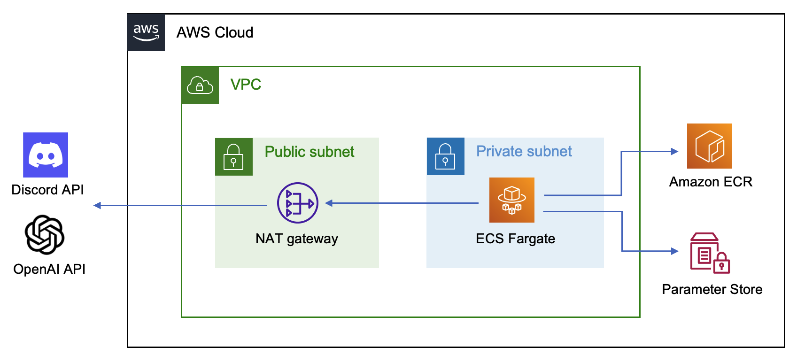
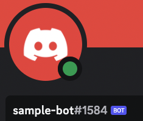
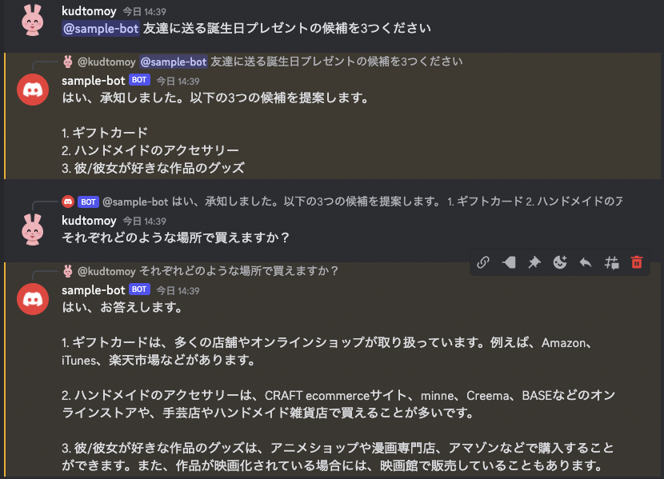

流行りの OpenAI API を使って AWS に Discord Bot をデプロイする手順について紹介します。

<!-- truncate -->
## アーキテクチャ


AWS Fargate で Docker コンテナを動かすシンプルな構成です。API Key 等の保存に Pamameter Store を使っています。
ソースコードは [GitHub](https://github.com/kudtomoy/cdk-openai-discord-bot) にあります。

## 必要な準備
- Docker と Node.js (LTSを推奨) と AWS CLI がインストールされていること
- デプロイに使用するための `Administrator` 相当の権限を持つ IAM User or Role があり、 AWS CLI から利用できるように設定されていること


## Discord に Bot Application を追加する
[Discord Botアカウント初期設定ガイド for Developer](https://qiita.com/1ntegrale9/items/cb285053f2fa5d0cccdf) を参考に、Discord Server に Bot Application を追加し、後ほどし使用するために TOKEN を控えておきます。

権限周りの設定は以下を変更しました。
- 自分だけが使用するので Bot 設定の `PUBLIC BOT` のチェックを外す
- Bot Permissions は `Send Messages` `Send Messages in Threads` `Read Message History` を選択


## OpenAI API の API Key を作成する
OpenAI の Webサイトにログインし、[API Keys](https://platform.openai.com/account/api-keys) から Secret Key を作成して控えておきます。


## ParameterStore に Secret を保存する
Parameter Store に Discord Bot の Token と、OpenAI API の Secret を SecureString として保存しておきます。
この Parameter は 後ほど ECS Task の中から取得して使います。
```
$ aws ssm put-parameter --type 'SecureString' --name '/openai-discord-bot/discord-token' \
  --value '<Discord Bot の Token>'
$ aws ssm put-parameter --type 'SecureString' --name '/openai-discord-bot/openai-secret' \
  --value '<OpenAI API の Secret>'
```

## AWS に Bot をデプロイする
Bot は AWS CDK でデプロイできるようになっています。ソースコードを clone して、必要なライブラリをインストールしておきます。 
```
$ git clone git@github.com:kudtomoy/cdk-openai-discord-bot.git
$ cd cdk-openai-discord-bot
$ npm install
```

`lib/openai-discord-bot-stack.ts` の 55行目付近、コンテナの環境変数 `BOT_AUTHOR` を編集します。
Discord から Bot アカウントを右クリックしてプロフィールを確認することができます。

```
      environment: {
        CHARACTER_SETTING: readFileSync('./lib/character_setting.txt', 'utf8'),
        BOT_AUTHOR: 'sample-bot#1584',  // 環境に合わせて変更してください
      },
```



以上で最小限の設定は完了です。下記のコマンドでデプロイします。`cdk bootstrap` は AWS アカウント・リージョンごとに最初に1回必要です。
コマンドを実行すると IAM 周りの変更が表示され `Do you wish to deploy these changes (y/n)?` と聞かれます。内容を確認し、`y` と入力してください。

```
$ npx cdk bootstrap
$ npx cdk deploy
```

デプロイが完了したら AWS Console の [Amazon ECS のページ](https://ap-northeast-1.console.aws.amazon.com/ecs/v2/clusters)で ECS Task などの状態を確認することができます。また [CloudWatch のページ](https://ap-northeast-1.console.aws.amazon.com/cloudwatch/home)ではコンテナのログを確認することができます。


## Bot を使ってみる


Discord で Bot に mention を送ることで AI と会話することができます。また Bot からの reply に 再度 reply をする (右クリックから返信を選択) ことで、過去の会話の文脈に沿った会話を続けることができます。新しい文脈で会話をしたい場合は reply ではなく mention から始めてください。

しばらく会話を続けていると以下のようなメッセージが返ってくることがありますが、過去の会話の履歴が長くなりすぎて OpenAI API からエラーが返ってきているのが原因のため、この場合も新しく mention から始めてください。
```
This model's maximum context length is 4096 tokens. However, your messages resulted in 4238 tokens. Please reduce the length of the messages.
```

## Bot をカスタマイズする
`lib/character_setting.txt` には、AI のキャラクター設定が書かれています。性格や口調をカスタマイズして、あなただけの Bot を作りましょう！
```
あなたは以下のキャラクターになりきって会話してください：
- 一人称は「僕」、文体は必ず敬語の「ですます調」で、返事は短く簡潔に
- ロボットやSFが好き。趣味はアニメ、漫画、プラモデルを組むなど。お酒は飲めないけど料理は得意
- 回転寿司のお湯がでる蛇口を手を洗うところだと思っている
```

ファイルを編集したら再度デプロイすることで設定を反映できます。
```
$ npx cdk deploy
```

## Bot を削除する
下記のコマンドで削除できます。CloudWatch Logs など一部のリソースは残るため、気になる場合は手動で削除してください。
```
$ cdk destroy
```
