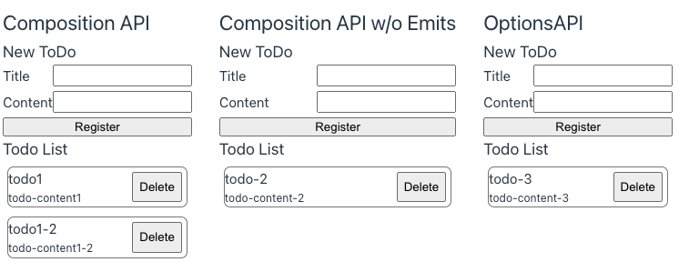

現在のフロントエンド開発では、TypeScript を利用した型安全な開発が一般的になってきました。  
Vue2 時代（特に Composition API 登場以前）は TypeScript との相性があまり良くなく、保守性の高い開発が困難な状況でした。  
しかし、Vue3 の登場により、TypeScript との相性が劇的に改善され、これについてまとめたいと思います。

<!-- truncate -->

## この記事を書いたモチベーション
筆者が初めて利用したフロントエンドフレームワークは Vue2 でした。  
Vue2 時代（特に Composition API 登場以前）は、TypeScript との相性が悪く、ソフトウェアが大きくなるにつれて保守性が悪くなることに苦労し、そのため React に乗り換えていました。  
最近の開発案件で Vue3 を利用したところ、React にも引けを取らないぐらい TypeScript との相性が改善され、型安全なプログラミングを行いやすくなっていたため、それについてまとめたいと思います。


## Vue3 と CompositionAPI について
Vue3 は、フロントエンドフレームワークである Vue.js の Version.3 系のものを指します。  
TypeScript との親和性が高くなり、型安全な開発を行いやすくなりました。  
また、Composition API が導入（正確には Vue2.7 から導入）されており、これを利用すると保守性の高いプログラミングを行うことができます。  
詳しくは、[Vue.js 公式ドキュメント](https://ja.vuejs.org/guide/extras/composition-api-faq.html)をご覧ください。
 
## 本記事で紹介するコード
本記事で紹介しているコードは、以下のリポジトリで公開しています。必要に応じでご覧ください。  
GitHubリポジトリ：[vue3-prototype-blog](https://github.com/wadabee/vue3-prototype-blog)  


  
本記事では、上記のようなシンプルなアプリケーションを作成しました（フロントエンドのみの構成）。  
New Todo の Title と Content を入力して、Register ボタンを押下すると、下部の Todo List に入力した Todo が表示されます。  
また、Delete ボタンを押下することで、当該 Todo を削除することができます。  
この機能を、Composition API、Composition API( Emitを利用しないパターン )、Options API でそれぞれ実装しています。  

## 型安全なコードの書き方
今回は最も基本的な、リアクティブなデータ定義、Props、Emitに絞って紹介します。  

### Composition API
Composition API では、以下のようなコードで実装しました。    

`src/components/CompositionApi.vue` (import と style は省略)
```typescript
<script setup lang="ts">
defineComponent({
  name: 'CompositionApi'
})

const todoList = ref<TodoType[]>([])
const registerTodo = (todo: TodoType) => {
  todoList.value.push(todo)
}

const deleteTodo = (index: number) => {
  todoList.value.splice(index, 1)
}
</script>

<template>
  <div :style="{ display: 'flex', flexDirection: 'column' }">
    <h2>Composition API</h2>
    <CATodoInput @register="registerTodo" />
    <CATodoList :todo-list="todoList" @delete="deleteTodo" />
  </div>
</template>
```

`src/components/CATodoInput.vue` (import と style は省略)
```typescript
<script setup lang="ts">
defineComponent({
  name: 'CATodoInput'
})

const title = ref<string>('')
const content = ref<string>('')

const emits = defineEmits<{
  (e: 'register', newTodo: TodoType): void
}>()

const onClickRegister = () => {
  emits('register', {
    title: title.value,
    content: content.value
  })
}
</script>

<template>
  <h3>New ToDo</h3>
  <div class="input-field">
    <label for="title">Title</label>
    <input
      type="text"
      id="title"
      :value="title"
      @input="
        (e :any) => {
          title = e.target.value
        }
      "
    />
  </div>

  <div class="input-field">
    <label for="content">Content</label>
    <input
      type="text"
      id="content"
      :value="content"
      @input="
        (e :any) => {
          content = e.target.value
        }
      "
    />
  </div>
  <button @click="onClickRegister">Register</button>
</template>
```

`src/components/CASTodoList.vue` (import と style は省略)
```typescript
<script setup lang="ts">
defineComponent({
  name: 'CASTodoList'
})

defineProps<{
  todoList: TodoType[]
}>()

const emits = defineEmits<{
  (e: 'delete', index: number): void
}>()

const onClickDelete = (index: number) => {
  emits('delete', index)
}
</script>

<template>
  <h3>Todo List</h3>
  <div v-for="(todo, idx) in todoList" :key="idx">
    <div class="todo">
      <div>
        <h4>{{ todo.title }}</h4>
        <div class="content">
          {{ todo.content }}
        </div>
      </div>
      <button class="delete-button" @click="() => onClickDelete(idx)">Delete</button>
    </div>
  </div>
</template>
```

#### 型安全にする Point
最も基本的なことですが、しっかりと変数、関数（引数、戻り値）に対して型定義を行うことが非常に重要です。  
対応コストが非常に低く、Template 部でも入力補足と型エラーが効くようになるため、非常に効果が高いです。  
必ず型を指定するようにしましょう。  
```typescript
const todoList = ref<TodoType[]>([])
const registerTodo = (todo: TodoType) => {
  todoList.value.push(todo)
}
```

続いて、Props に対する型定義となります。  
下記のように `defineProps` を利用することで、Props に対して型定義を行うことができます。  
親コンポーネントの Template 部から当該コンポーネントを参照する際に、この定義に沿って入力補足と型エラーが効くようになります。  
コンポーネント数が増えてくると、Props の型不一致によるバグが起こりやすくなるので、こちらも必ず設定するようにしましょう。  
```typescript
defineProps<{
  todoList: TodoType[]
}>()
```

型定義によって、必須・任意の切り替えも可能です。  
TypeScript の `type` の定義と文法が同じなので、直感的です。  
また、`script` 部で Props を利用することも可能です（もちろん、入力補足と型エラーが効きます）。    
```typescript
const props = defineProps<{
  requiredProp: string
  optionalProp?: string
}>()

// script 部でも props を利用可能
const hoge = props.requiredProp
const fuga = props.optionalProp ?? ''
```

最後に、Emit に対する型定義となります。  
下記のように `defineEmits` を利用することで、Emit に対して型定義を行うことができます。    
イベント名と、その引数と戻り値を定義することが可能です。  

```typescript
const emits = defineEmits<{
  (e: 'delete', index: number): void
}>()

const onClickDelete = (index: number) => {
  emits('delete', index)
}
```
親コンポーネントから当該コンポーネントを呼び出す際は、以下のように記述します。  
`@delete` で削除イベントのハンドリングを行いますが、このハンドリングを行う際も入力補足、型エラーが効きます。  
複雑なコンポーネントは、イベントハンドリングも複雑になりがちです（個人的には一番複雑化しやすい部分だと思っています）。   
こちらも、型定義をしっかり行う様にしましょう。  
しかし、ハンドリング漏れや、存在しないイベントに対するハンドリングを行なってもエラーにならないため、注意が必要です。  
```typescript
  // 良いパターン
  <CATodoList :todo-list="todoList" @delete="deleteTodo" />

  // 存在しない event を指定してもエラーにならない
  <CATodoList :todo-list="todoList" @any-event="deleteTodo" />

  // ハンドリングを行わなくてもエラーにならない
  <CATodoList :todo-list="todoList"  />
```

### Composition API　（Emit を利用しないパターン）
上記でご説明した通り、Emit を使ったイベントハンドリングでは、型安全とは言い難い状況です。  
そこで、React では一般的な実装となっている「親コンポーネントからイベントハンドラーを渡して、子コンポーネントで実行する」というコードをご紹介します。  

`src/components/CompositionApiWithoutEmits.vue` (import と style は省略)
```typescript
<script setup lang="ts">
defineComponent({
  name: 'CompositionApiWithoutEmits'
})

const todoList = ref<TodoType[]>([])
// 通常通りイベントハンドラーを定義する
const registerTodo = (todo: TodoType) => {
  todoList.value.push(todo)
}
const deleteTodo = (index: number) => {
  todoList.value.splice(index, 1)
}
</script>

<template>
  <div :style="{ display: 'flex', flexDirection: 'column' }">
    <h2>Composition API w/o Emits</h2>
    <!-- v-onディレクティブを使わずにハンドラーをPropsとして渡す -->
    <CAWithoutEmitsTodoInput :on-register="registerTodo" />
    <CAWithoutEmitsTodoList :todo-list="todoList" :on-delete="deleteTodo" />
  </div>
</template>
```

`src/components/CAWithoutEmitsTodoInput.vue` (import と style は省略)
```typescript
<script setup lang="ts">
defineComponent({
  name: 'CAWithoutEmitsTodoInput'
})

const props = defineProps<{
  // Propsとしてハンドラーを受け取る
  onRegister: (newTodo: TodoType) => void
}>()

const title = ref<string>('')
const content = ref<string>('')

const onClickRegister = () => {
  // Emitせずに、Propsとして受け取ったハンドラーを実行する
  props.onRegister({
    title: title.value,
    content: content.value
  })
}
</script>

<template>
  <h3>New ToDo</h3>
  <div class="input-field">
    <label for="title">Title</label>
    <input
      type="text"
      id="title"
      :value="title"
      @input="
        (e :any) => {
          title = e.target.value
        }
      "
    />
  </div>

  <div class="input-field">
    <label for="content">Content</label>
    <input
      type="text"
      id="content"
      :value="content"
      @input="
        (e :any) => {
          content = e.target.value
        }
      "
    />
  </div>
  <button @click="onClickRegister">Register</button>
</template>
```

`src/components/CAWithoutEmitsTodoList.vue` (import と style は省略)
```typescript
<script setup lang="ts">
defineComponent({
  name: 'CAWithoutEmitsTodoList'
})

const props = defineProps<{
  todoList: TodoType[]
  // Propsとしてハンドラーを受け取る
  onDelete: (index: number) => void
}>()

const onClickDelete = (index: number) => {
  // Emitせずに、Propsとして受け取ったハンドラーを実行する
  props.onDelete(index)
}
</script>

<template>
  <h3>Todo List</h3>
  <div v-for="(todo, idx) in todoList" :key="idx">
    <div class="todo">
      <div>
        <h4>{{ todo.title }}</h4>
        <div class="content">
          {{ todo.content }}
        </div>
      </div>
      <button class="delete-button" @click="() => onClickDelete(idx)">Delete</button>
    </div>
  </div>
</template>
```

#### 型安全にする Point
Emit を使うパターンでは、`子コンポーネントで発火したイベントを親コンポーネントで検知して、親コンポーネント側でハンドラーを実行する`という流れでした。  
それに対して、Emit を使わないパターンでは、`子コンポーネントでイベントが発火したら、親コンポーネントから渡されたハンドラーを子コンポーネント側で実行する`という流れになります。  

この実装のメリットはより型安全にコーディングできることにあります。  
アプリケーションの大規模化やコンポーネントの複雑化が進んだ際に、より保守性を高めやすくなります。  
例を見てみましょう。

子コンポーネントのPropsが、以下の様に定義されていたとします。  
こちらは登録処理( onRegister )は必須、削除処理( onDelete )は任意となります。  
```typescript
const props = defineProps<{
  onRegister: (data: SomethingType) => void
  onDelete?: (index: number) => void
}>()
```
親コンポーネントを実装する際は、以下の様になります。  
登録処理は必須であるため、Props として設定していない場合は型エラーが発生するので、コーディングミスに気づくことができます。  
削除処理は任意であるため、削除処理が必要ない場合は設定する必要はありません。  
型定義を行なっているため、このハンドラーの関数を設定する際も引数、戻り値の型で、入力補完、型エラーが効きます。  
```typescript
<template>
  <!-- 登録処理のみ実行したい場合 -->
  <ChildComponent :onRegister={registerFunc} />
  <!-- 登録と削除処理を両方実行したい場合 -->
  <ChildComponent :onRegister={registerFunc} :onDelete={deleteFunc} />

  <!-- 必須である登録処理が未設定であるためエラー -->
  <ChildComponent />
</template>
```

Vue の仕様として、Props として定義されていない属性を指定してもエラーになりません。  
こちらは、[フォールスルー属性](https://ja.vuejs.org/guide/components/attrs.html)の仕様と思われます。  
ちなみに、`inheritAttrs: false`　を設定しても、属性が継承されないだけで型エラーは発生しません。  
Props　定義を修正した場合は、親コンポーネントの修正を忘れない様に注意してください。  
```typescript
<template>
  <!-- 未定義のPropsに対してハンドラーを設定してもエラーにならない -->
  <ChildComponent2 :on-nothing-event={registerFnc}/>
</template>
```


### Options API
最後に Options API の実装例も見てみましょう。  

`src/components/OptionsApi.vue` (import と style は省略)
```typescript
<script lang="ts">
export default {
  name: 'OptionsApi',
  components: {
    OATodoInput,
    OATodoList
  },
  data() {
    return {
      todoList: [] as TodoType[]
    }
  },
  methods: {
    registerTodo(todo: TodoType) {
      this.todoList.push(todo)
    },
    deleteTodo(index: number) {
      this.todoList.splice(index, 1)
    }
  }
}
</script>

<template>
  <div :style="{ display: 'flex', flexDirection: 'column' }">
    <h2>OptionsAPI</h2>
    <OATodoInput @register="registerTodo" />
    <OATodoList :todo-list="todoList" @delete="deleteTodo" />
  </div>
</template>
```

`src/components/OATodoInput.vue` (import と style は省略)
```typescript
<script lang="ts">
export default defineComponent({
  name: 'OATodoInput',
  data() {
    return {
      title: '',
      content: ''
    }
  },
  emits: {
    // eslint-disable-next-line @typescript-eslint/no-unused-vars
    register: (_todo: TodoType) => true
  },
  methods: {
    onClickRegister() {
      this.$emit('register', {
        title: this.title,
        content: this.content
      })
    }
  }
})
</script>

<template>
  <h3>New ToDo</h3>
  <div class="input-field">
    <label for="title">Title</label>
    <input
      type="text"
      id="title"
      :value="title"
      @input="
        (e :any) => {
          title = e.target.value
        }
      "
    />
  </div>

  <div class="input-field">
    <label for="content">Content</label>
    <input
      type="text"
      id="content"
      :value="content"
      @input="
        (e :any) => {
          content = e.target.value
        }
      "
    />
  </div>
  <button @click="onClickRegister">Register</button>
</template>
```

`src/components/OATodoList.vue` (import と style は省略)
```typescript
<script lang="ts">
export default defineComponent({
  name: 'OATodoList',
  props: {
    todoList: {
      type: Object as PropType<TodoType[]>,
      required: true
    }
  },
  emits: {
    // eslint-disable-next-line @typescript-eslint/no-unused-vars
    delete: (index: number) => true
  },
  methods: {
    onClickDelete(index: number) {
      this.$emit('delete', index)
    }
  }
})
</script>

<template>
  <h3>Todo List</h3>
  <div v-for="(todo, idx) in todoList" :key="idx">
    <div class="todo">
      <div>
        <h4>{{ todo.title }}</h4>
        <div class="content">
          {{ todo.content }}
        </div>
      </div>
      <button class="delete-button" @click="() => onClickDelete(idx)">Delete</button>
    </div>
  </div>
</template>
```

#### 型安全にする Point
Options API でも、Composition API とほぼ同等な型安全性を実現することができます。  
しかし、型定義の際に、TypeScript の標準的な書き方ではなく、Vue の Options API 独特の書き方が必要になります。  

変数は、`data` を定義する際に、`as` を利用して型定義を行う必要があります。  
```typescript
  data() {
    return {
      todoList: [] as TodoType[]
    }
  }
```

Props は `as` を利用して、`PropType` を設定することで、型定義が可能になります。  
`PropType` の Generic 型として引き渡しているものが、Props のデータ型となります。  
Props のデータ型を関数にしてイベントハンドラーを引き渡すことで、上記で説明した` Composition API　（Emit を利用しないパターン）`と同等の実装を行うことができます。  
```typescript
  props: {
    todoList: {
      type: Object as PropType<TodoType[]>,
      required: true
    }
  }
```

関数は、通常の TypeScript の関数と同じ要領で型定義が可能です。  
methods の中ではアロー関数が使えないため、注意が必要です（ `this` のスコープがおかしくなリます）
```typescript
  methods: {
    someFunction(arg: string): boolean {
      // 省略
    }
  }
```

Emit は、Validation の機能を利用することで、型定義が可能です。  
本来は、Emit の Validation を行うための機能（ false を return すると validation エラーが発生する）ですが、型定義に利用するだけですので、固定で true を return しています。  
Validation の詳細については、[こちら](https://ja.vuejs.org/guide/typescript/options-api.html#typing-component-emits)を参照してください。  
```typescript
  emits: {
    // null だと型定義されない
    onSomeEvent1: null,
    // この書き方で、引数の型定義が可能
    onSomeEvent2: (arg: string) => true
  }
```

## Composition API と Options API どちらが型安全なのか？  
基本的な使い方であれば、どちらも同等な型安全性でした。  
（高度な使い方をすれば、また感想は変わってくるかもしれません）  

> Options API は、コンポーネントコードを書くときに「考えることを減らす」ことを可能にし、それが多くのユーザーに支持されている理由です。しかし、精神的なオーバーヘッドを減らす一方で、逃げ場のない規定のコード構成パターンに縛られてしまい、大規模なプロジェクトではリファクタリングやコード品質の向上が困難になる可能性があります。この点、Composition API は、長期的なスケーラビリティに優れています。  

>Composition API の利点の多くは大規模プロジェクトでこそ現れるものであり、多くの低~中程度の複雑性のシナリオにおいては Options API が堅実な選択肢であり続けることも理解しています。

引用：[公式ドキュメント](https://ja.vuejs.org/guide/extras/composition-api-faq.html#trade-offs)より  

コードの保守性という観点で見れば、上記の記載の通りComposition API に軍配が上がりそうです。  
どちらを選択するかどうかは、開発するチームの属性で決めれば良いのかなと思います。  
私個人の意見としては、標準的な TypeScript のコードに近い書き方ができる Composition API がおすすめです。  


### まとめ
以上が、Vue3 で型安全な開発を実現する方法でした。  
Vue3 には、さまざまな書き方があるため、情報収集に苦労しました（目的の記事がピンポイントでヒットせず...）。  
情報収集を行う際は、Composition API、Options API をキーワードに含めることをお勧めします。  

