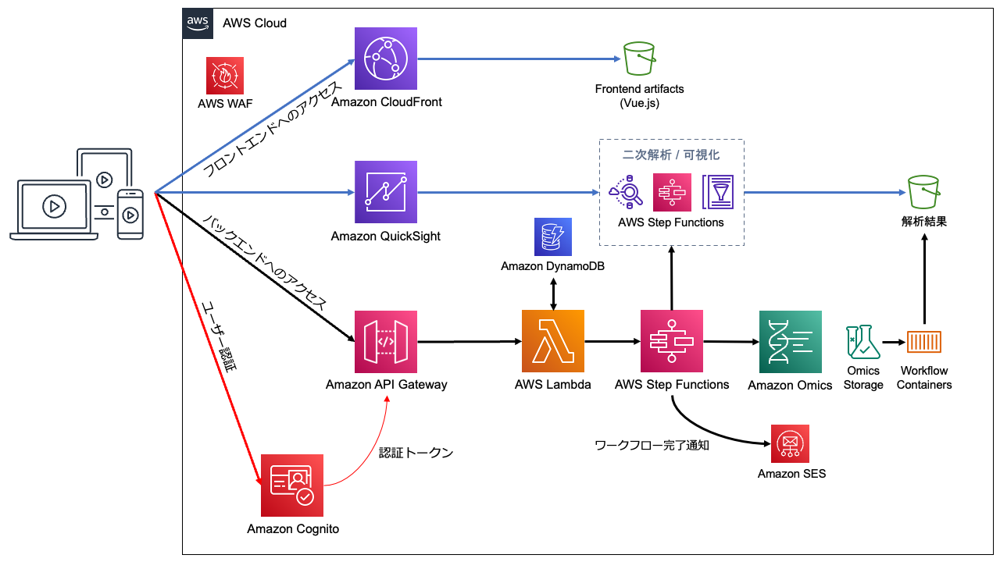
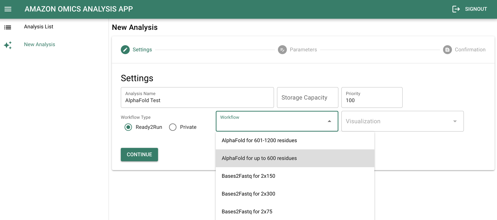
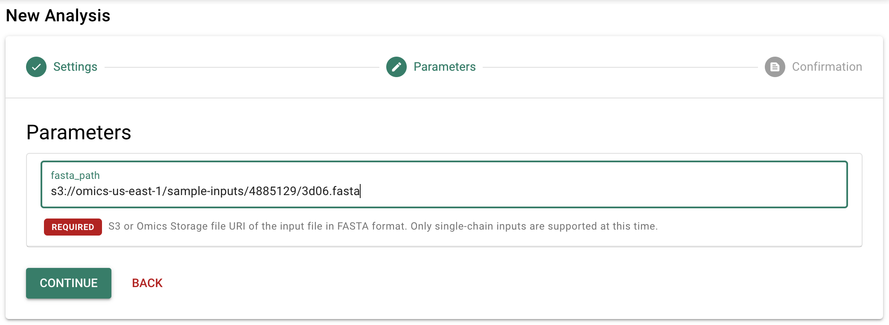
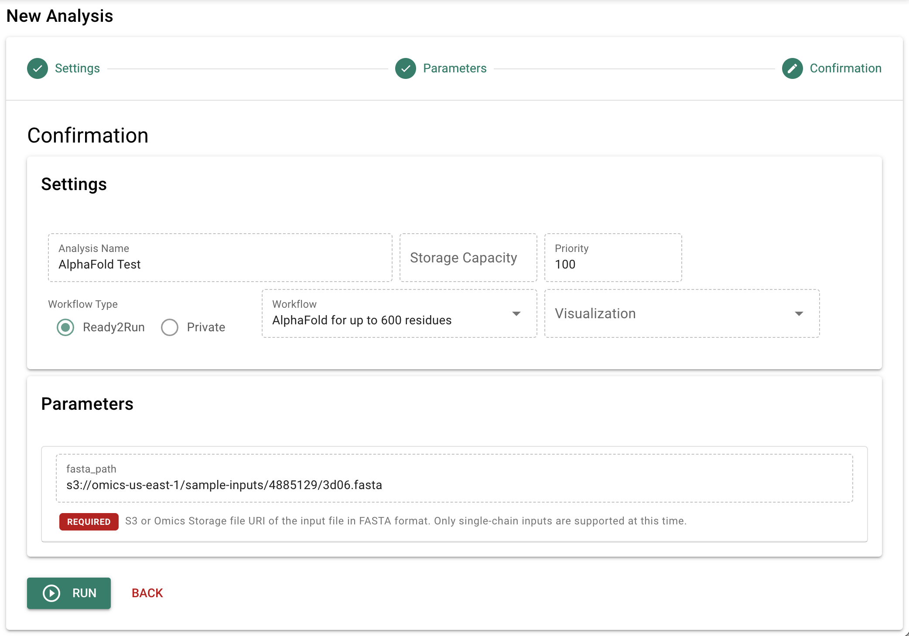
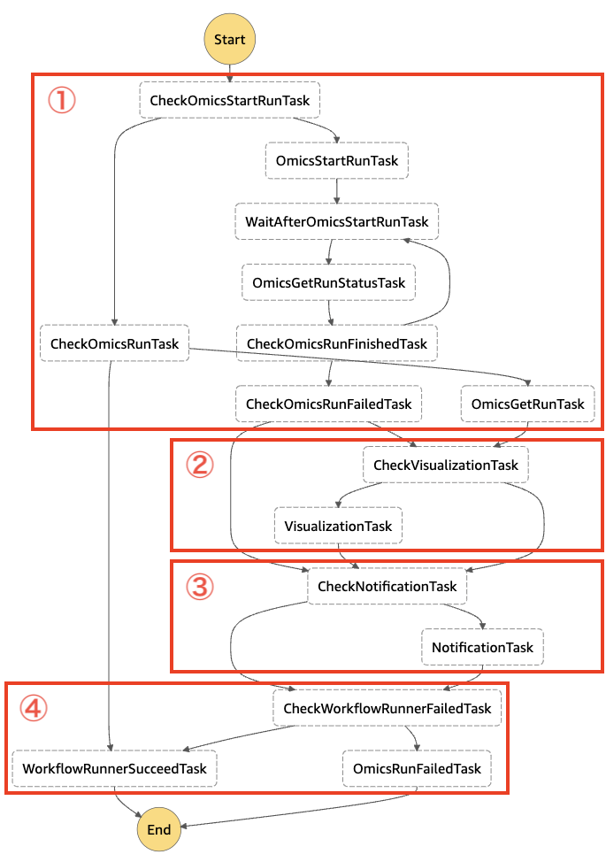
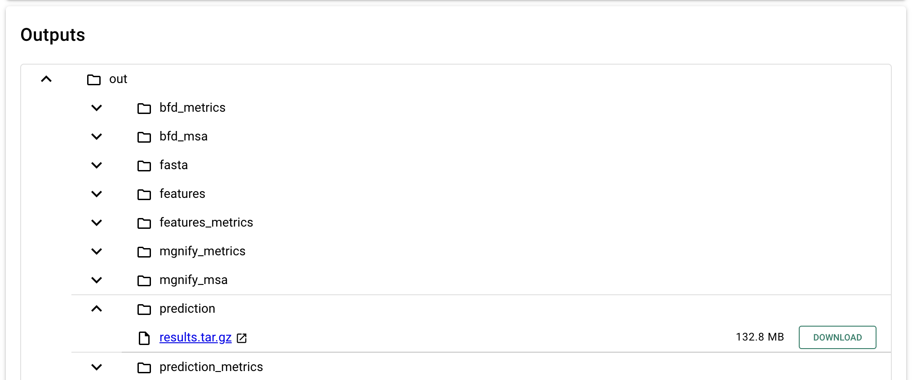
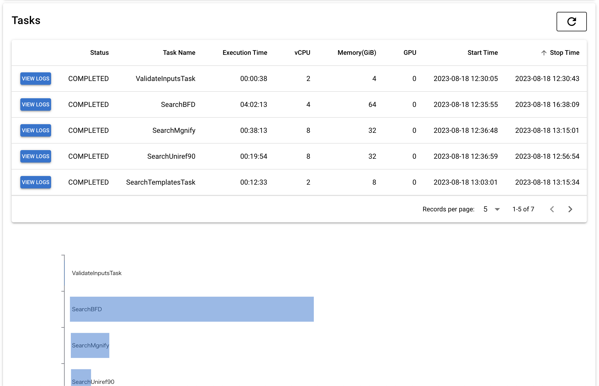

ヘルスケア・ライフサイエンス分野において、大規模なオミクスデータを分析するためのコンピューティングのニーズは日々増大しています。今回は、AWS が提供するオミクスデータ分析のためのマネージドサービス「AWS HealthOmics」を使ったオミクスデータ分析ワークフローの構築方法について解説します。

<!-- truncate -->

## AWS HealthOmics とは

[AWS HealthOmics](https://aws.amazon.com/jp/healthomics/) は、オミクス (ゲノム (Genomics) や転写産物 (Transcriptomics) など、生物学分野で -omics という名前を持つ大規模データの総称) データを扱うためのマネージドサービスです。オミクスデータを保存する Storage、クエリや分析を行う Analytics、分析ワークフローを実行する Workflows の 3 つの機能を提供しています。各機能の詳細については[公式ページ](https://aws.amazon.com/jp/healthomics/features/)や [AWS Blog の記事](https://aws.amazon.com/jp/blogs/news/introducing-amazon-omics-a-purpose-built-service-to-store-query-and-analyze-genomic-and-biological-data-at-scale/)、[公式ハンズオン](https://catalog.workshops.aws/amazon-omics-end-to-end/ja-JP)などをご参照ください。

AWS では、AWS HealthOmics による分析ワークフローの実行と分析結果の閲覧ができる Web アプリケーション「[AWS HealthOmics Analysis App](https://github.com/aws-samples/amazon-omics-analysis-app)」をサンプルとして公開しています。今回はこのアプリケーションを題材に、AWS HealthOmics を使ったオミクスデータ分析ワークフローについて解説します。

## AWS HealthOmics Analysis App の概要

[AWS HealthOmics Analysis App](https://github.com/aws-samples/amazon-omics-analysis-app) は、AWS HealthOmics を使ってオミクスデータの分析ワークフローを実行し、分析結果を閲覧する Web アプリケーションのサンプル実装です。このアプリでは、以下のような機能を実装しています。

- [AWS HealthOmics](https://aws.amazon.com/jp/healthomics/) によるバイオインフォマティックスのワークフローの実行
- [AWS Step Functions](https://aws.amazon.com/jp/step-functions/) によるワークフローの二次解析 (可視化) や完了通知の実行
- [Amazon Simple Email Service (SES)](https://aws.amazon.com/jp/ses/) によるワークフロー完了通知メールの送信
- ワークフロー実行結果のブラウズ
- ワークフローで実行されたタスクの詳細情報の表示

アプリケーションの全体アーキテクチャと、各サービスの役割は以下の通りです。



| サービス            | 役割 |
| :----------------- | :-- |
| Amazon CloudFront  | Vue.js で実装されたフロントエンドのアセットを配信 |
| Amazon S3          | Vue.js で実装されたフロントエンドのアセットを格納 |
| Amazon Cognito     | ユーザー認証を行うためのユーザープールを提供<br/>ユーザープールをフロントエンドやバックエンドから利用するためのユーザープールクライアントを提供 |
| Amazon API Gateway | フロントエンドに対してバックエンドの REST API を提供 |
| AWS Step Functions | AWS HealthOmics ワークフローの実行や二次解析 (可視化) 等のタスクを実行するステートマシンを提供 |
| AWS Lambda         | バックエンド API を実装した Lambda 関数を実行<br/>Step Functions ステートマシンのタスクを実装した Lambda 関数を実行 |
| Amazon DynamoDB    | Step Functions で実行される二次解析 (可視化) の実行結果を管理 |
| Amazon QuickSight  | ワークフローの出力を可視化するためのダッシュボードを表示 |
| AWS WAF            | フロントエンドやバックエンド API にアクセスできる IP アドレスを制限 |

[GitHub の README](https://github.com/aws-samples/amazon-omics-analysis-app/blob/main/README.ja.md) に書かれたデプロイ手順に従って、利用方法を解説します。

## AWS HealthOmics Analysis App のデプロイ

### 前提条件

AWS HealthOmics Analysis App は [AWS Cloud Development Kit (CDK)](https://aws.amazon.com/jp/cdk/) を使って AWS サービスの設定を行います。AWS CDK を使うには、前提条件として以下のソフトウェアがインストールされている必要があります。詳細は[こちらのドキュメント](https://docs.aws.amazon.com/ja_jp/cdk/v2/guide/getting_started.html#getting_started_prerequisites)をご参照ください。

- [AWS Command Line Interface (AWS CLI)](https://aws.amazon.com/jp/cli/)
- [Node.js](https://nodejs.org/ja)
- [Docker](https://www.docker.com/)

上記の条件を満たす環境として、[AWS Cloud9](https://aws.amazon.com/jp/cloud9/) を使う事もできます。

### デプロイ

[AWS HealthOmics Analysis App の GitHub リポジトリ](https://github.com/aws-samples/amazon-omics-analysis-app)を clone し、[デプロイ手順のドキュメント](https://github.com/aws-samples/amazon-omics-analysis-app/blob/main/README.ja.md#%E3%83%87%E3%83%97%E3%83%AD%E3%82%A4%E6%96%B9%E6%B3%95)に従ってデプロイを実施してください。

なお、AWS HealthOmics が利用できるリージョンは現時点 (2023/9/20) で以下のようになっており、AWS HealthOmics Analysis App は us-east-1 リージョンにデプロイされる事を前提としています。

- us-east-1 (米国東部: バージニア北部)
- us-west-2 (米国西部: オレゴン)
- ap-southeast-1 (アジアパシフィック: シンガポール)
- eu-central-1 (欧州: フランクフルト)
- eu-west-1 (欧州: アイルランド)
- eu-west-2 (欧州: ロンドン)

## Ready2Run ワークフローを実行する

デプロイが完了したら、早速ワークフローを実行してみましょう。AWS HealthOmics では、以下の2種類のワークフローを実行することができます。

- 初期設定不要ですぐに使える [Ready2Run ワークフロー](https://docs.aws.amazon.com/omics/latest/dev/service-workflows.html)
- ユーザーがコードと初期設定を任意にカスタマイズできる[プライベートワークフロー](https://docs.aws.amazon.com/omics/latest/dev/workflows.html)

今回は、Ready2Run ワークフローの中から、タンパク質の立体構造を予測する [AlphaFold](https://github.com/google-deepmind/alphafold) を実行しようと思います。Ready2Run ワークフローの使い方は AWS HealthOmics コンソールの [Ready2Run ワークフローのページ](https://console.aws.amazon.com/omics/home#/ready2run)で確認する事ができ、簡単に実行を試せるサンプルデータも提供されているので、今回はそれを利用して AlphaFold を実行します。

### 実行手順

1. AWS HealthOmics Analysis App にサインインしたら「New Analysis」をクリックします。
2. 次の画面で「Workflow」をクリックすると Ready2Run ワークフローの一覧が表示されるので、「AlphaFold for up to 600 residues」を選択します。
3. 「Analysis Name」に任意の名前を入力して「CONTINUE」をクリックします。(「Visualizer」は今回は指定しません)



4. 次の画面で「fasta_path」に以下の S3 URL を入力し、「CONTINUE」をクリックします。

```
s3://omics-us-east-1/sample-inputs/4885129/3d06.fasta
```



5. 次の画面に表示された内容を確認し、「RUN」をクリックします。



6. 確認ダイアログが表示されるので、「OK」をクリックします。

入力内容に問題がなければ、ワークフローを実行するための Step Functions ステートマシンが開始されます。「Analysis List」の更新ボタンを押すと、開始された AWS HealthOmics ワークフローが一覧に表示されます。

AlphaFold のサンプルの実行には6〜7時間ほどかかりますが、完了するとアカウントのメールアドレスに完了通知メールが送信されます。<br/>
(メールを受信するには、事前にそのメールアドレスを Amazon SES の「検証済みID」として登録しておく必要があります。詳細は Amazon SES デベロッパーガイドの「[Eメールアドレス ID の作成](https://docs.aws.amazon.com/ja_jp/ses/latest/dg/creating-identities.html#verify-email-addresses-procedure)」をご参照ください。)

## Step Functions によるワークフローの実行

Step Functions ステートマシンでは、以下のようなステップでタスクが実行されます。

1. AWS HealthOmics ワークフローを実行する。
2. (指定されていれば) 二次解析 (可視化) を実行する。
3. 完了通知を実行する。
4. ステートマシンの終了処理。



各ステップで実行されるタスクを解説します。タスクの詳細については[公式ドキュメント](https://docs.aws.amazon.com/ja_jp/step-functions/latest/dg/concepts-states.html)をご参照ください。

### AWS HealthOmics ワークフローの実行

| タスク名                    | タスク種別  | 処理内容 |
| -------------------------- | --------- | ------- |
| CheckOmicsStartRunTask     | Choice    | ステートマシンの入力に `OmicsStartRun` が含まれているかを確認 |
| OmicsStartRunTask          | Lambda    | AWS HealthOmics のワークフローを実行 |
| WaitAfterOmicsStartRunTask | Wait      | AWS HealthOmics のワークフロー完了を数分間待機 |
| OmicsGetRunStatusTask      | Lambda    | AWS HealthOmics のワークフロー実行状態を取得し、`OmicsRun` として出力 |
| CheckOmicsRunFinishedTask  | Choice    | AWS HealthOmics ワークフローが完了したかを確認 |
| CheckOmicsRunFailedTask    | Choice    | AWS HealthOmics ワークフローが失敗したかを確認 |

ステートマシンの入力に `OmicsStartRun` が含まれていなかった場合、ワークフローの新規実行は行わずに以下のタスクに分岐します。

| タスク名           | タスク種別  | 処理内容 |
| ----------------- | --------- | ------- |
| CheckOmicsRunTask | Choice    | ステートマシンの入力に `OmicsRun` が含まれているかを確認 |
| OmicsGetRunTask   | Lambda    | AWS HealthOmics のワークフロー実行状態を取得する |

### 二次解析 (可視化) の実行

| タスク名                | タスク種別       | 処理内容 |
| ---------------------- | -------------- | ------- |
| CheckVisualizationTask | Choice         | ステートマシンの入力に `Visualization` が含まれているかを確認 |
| VisualizationTask      | Step Functions | ワークフロー実行結果の二次解析 (可視化) を実行するため、別の Step Functions ステートマシンを起動 |

### 完了通知の実行

| タスク名               | タスク種別  | 処理内容 |
| --------------------- | --------- | ------- |
| CheckNotificationTask | Choice    | ステートマシンの入力に `Notification` が含まれているかを確認 |
| NotificationTask      | Lambda    | Amazon SES で完了通知メールを送信 |

### ステートマシンの終了処理

| タスク名                       | タスク種別 | 処理内容 |
| ----------------------------- | -------- | ------- |
| CheckWorkflowRunnerFailedTask | Choice   | AWS HealthOmics ワークフローが失敗したかを確認 |
| WorkflowRunnerSucceedTask     | Succeed  | ステートマシンの状態を正常終了とする |
| OmicsRunFailedTask            | Fail     | ステートマシンの状態を失敗とする |

## 分析結果のブラウズ

ワークフローの実行が完了したら、分析結果をブラウズする事ができるようになります。「Analysis List」で該当のワークフローをクリックするか、または完了通知メールが届いた場合はメール内のリンクをクリックすると分析の詳細情報が表示され、「Outputs」でワークフローの出力ファイルをブラウズすることができます。



ファイル名をクリックすると、ブラウザで表示可能な形式 (PDF や画像など) のファイルであれば別のタブで表示されます。「DOWNLOAD」をクリックすると、ファイルをダウンロードすることができます。

ブラウザで表示できない形式の出力ファイルについては、AWS HealthOmics Analysis App に二次解析によるデータ変換や可視化手法の登録を行うことで表示が可能となります。詳細については別の記事で解説予定です。

「Tasks」では、ワークフローで実行されたタスクの詳細情報を確認することができます。



タスクの名前と実行時間、使用した vCPU やメモリ量などが表形式で表示され、その下では実行の時系列をグラフで確認できます。「VIEW LOGS」ボタンを押すと、タスクが実行中に CloudWatch Logs に出力したログを確認することができます。

## まとめ

今回は、AWS HealthOmics のご紹介と、このサービスを AWS Step Functions と組み合わせたサンプルアプリである AWS HealthOmics Analysis App の解説を行いました。これらのサービスを活用することで、スケーラブルなオミクスデータ分析ワークフローを AWS 上に手軽に構築する事が可能となります。

次の記事: [AWS HealthOmics で AlphaFold を実行し、タンパク質の立体構造を可視化する](https://prototyping-blog.com/blog/aws-healthomics-analysis-app-alphafold/)
