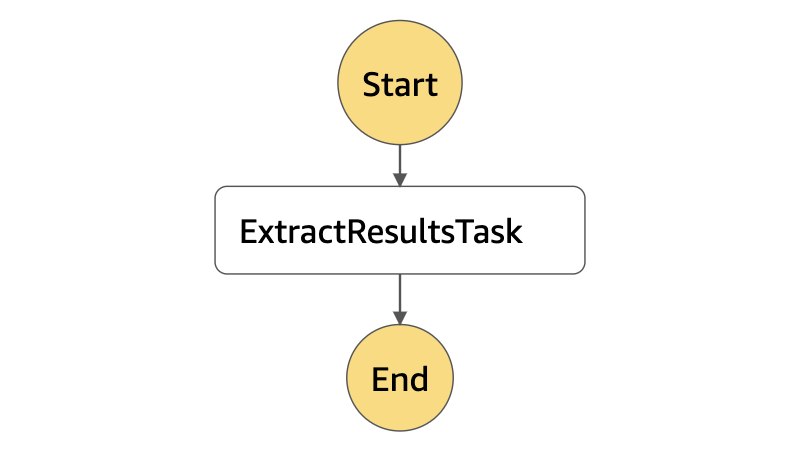
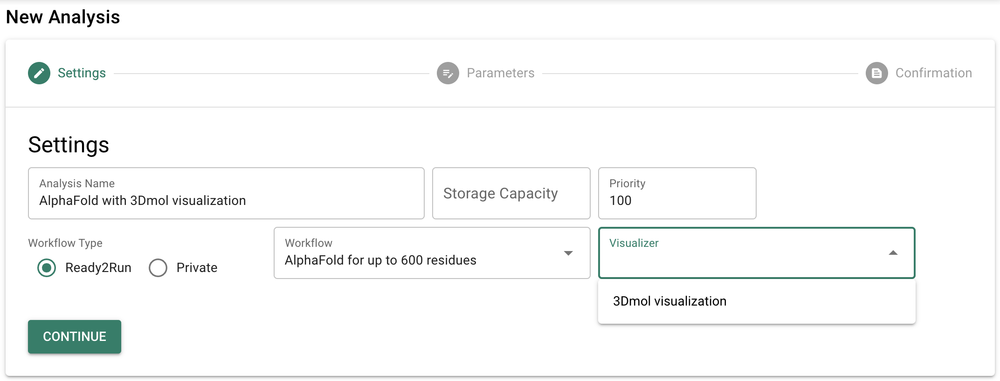
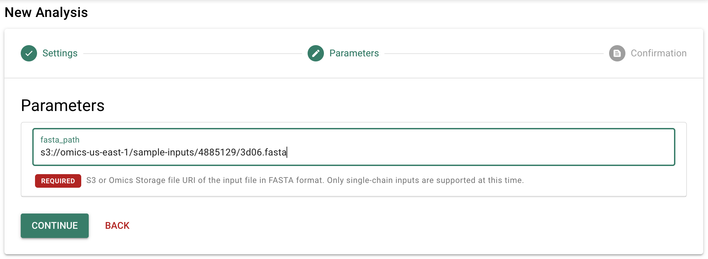
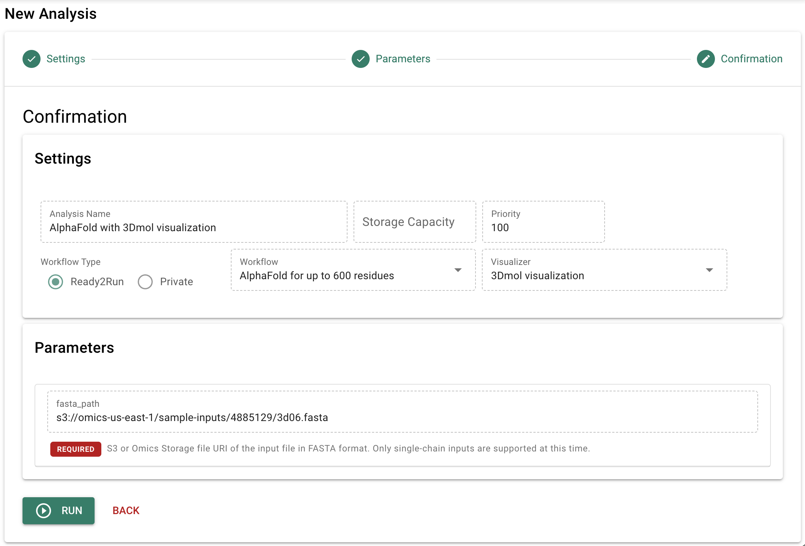
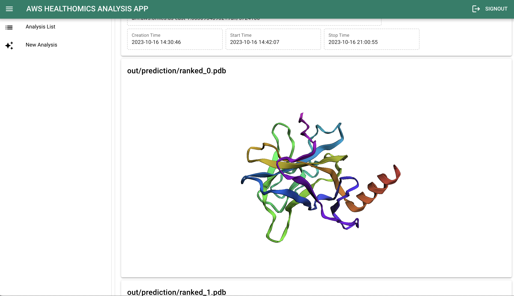

AWS HealthOmics では、設定不要で手軽に利用できる Ready2Run ワークフローとして、タンパク質の立体構造を予測するオープンソースソフトウェアである AlphaFold が提供されています。今回は、[以前の記事](https://prototyping-blog.com/blog/aws-healthomics-analysis-app)で紹介した「AWS HealthOmics Analysis App」で AlphaFold を実行し、予測されたタンパク質の立体構造を可視化する方法について解説します。

<!-- truncate -->

## 前回のおさらい

[前回の記事](https://prototyping-blog.com/blog/aws-healthomics-analysis-app)では、AWS HealthOmics を使った Web アプリケーションのサンプル実装である [AWS HealthOmics Analysis App](https://github.com/aws-samples/amazon-omics-analysis-app) のアーキテクチャや利用方法について解説しました。また、オミクスデータ分析ワークフローの例として、Ready2Run ワークフローとして提供されている AlphaFold を実行し、実行結果をダウンロードするまでの手順を解説しました。

今回は、AlphaFold の実行結果からタンパク質の立体構造データを取得し、Web アプリ上で 3D 表示する方法を解説します。

## アーキテクチャ

AWS HealthOmics Analysis App の概要とアーキテクチャについては、[前回の記事](https://prototyping-blog.com/blog/aws-healthomics-analysis-app/#aws-healthomics-analysis-app-%E3%81%AE%E6%A6%82%E8%A6%81)をご参照ください。今回は、AlphaFold の実行結果の可視化に関する部分を解説します。

AWS HealthOmics Analysis App では、AWS HealthOmics ワークフローの実行後に二次解析 (可視化) を実行することができます。ワークフローで実行可能な可視化の種類は、以下の定義を持つ DynamoDB テーブル `OmicsWorkflowVisualizers` で管理されます。

| カラム名         | 型      | 内容 |
| --------------- | ------ | ---- |
| workflowId      | String | ワークフロー ID |
| visualizerId    | String | 可視化 ID |
| name            | String | 可視化の名前 |
| stateMachineArn | String | 可視化を実行する Step Functions ステートマシンの ARN |

また、二次解析の処理において、Web アプリ上での可視化の対象となるものがあれば、以下の定義を持つ DynamoDB テーブル `OmicsRunVisualizations` に登録します。

| カラム名         | 型      | 内容                       | 値 |
| --------------- | ------ | -------------------------- | - |
| runId           | String | ワークフローの実行 ID         |   |
| visualizationId | String | 可視化 ID                   |   |
| type            | String | 可視化の種類                 | `QuickSightDashboard`: QuickSight ダッシュボード<br/>`3Dmol`: 3Dmol による立体構造の 3D 表示 |
| dashboardId     | String | QuickSight ダッシュボード ID | (`type` が `QuickSightDashboard` の場合)<br/>Web アプリ上に埋め込む QuickSight ダッシュボードの ID<br/> |
| pdbPath         | String | 立体構造ファイルのパス         | (`type` が `3Dmol` の場合)<br/>Web アプリ上で 3Dmol を使って表示する PDB 形式の立体構造ファイルのパス<br/>(ワークフローの出力先 S3 URL からの相対パス) |

今回解説する AlphaFold の可視化では、`AlphaFold3DmolVisualizer` という Step Functions ステートマシンを利用します。このステートマシンでは、AlphaFold の出力に含まれる立体構造予測データを展開する AWS Glue Python Shell ジョブを実行します。



| タスク名            | タスク種別 | 処理内容 |
| ------------------ | -------- | ------- |
| ExtractResultsTask | Glue Job | AlphaFold の予測結果を展開する Glue Python Shell ジョブ `AlphaFoldExtractResultsJob` を実行 |

## AlphaFold 実行結果の展開

AWS HealthOmics の Ready2Run ワークフローに含まれる AlphaFold では、タンパク質の立体構造の予測結果を `out/prediction/results.tar.gz` というアーカイブファイルとして出力します。このアーカイブには、以下のファイルが含まれています。

| ファイル名                               | 種別 | 内容 |
| -------------------------------------- | ---- | ---- |
| ranked_\[0-4\].pdb                     | [PDB](https://pdbj.org/help/data-format?lang=ja) | Amber relaxation 適用後に pLDDT でランク付けされた立体構造データ |
| unrelaxed_model_\[1-5\]_ptm_pred_0.pdb | PDB  | 各モデルから予測された立体構造データ |
| model_\[1-5\]_ptm_pred_0_pae.png       | [PNG](https://ja.wikipedia.org/wiki/Portable_Network_Graphics) | 各モデルの Predicted Aligned Error の画像 |
| result_model_\[1-5\]_ptm_pred_0.pkl    | [PKL](https://docs.python.org/ja/3/library/pickle.html) | 各モデルから AlphaFold が生成した全データのシリアライズ |
| ranking_debug.json                     | [JSON](https://ja.wikipedia.org/wiki/JavaScript_Object_Notation) | 各モデルの pLDDT 情報 |
| timings.json                           | JSON | AlphaFold のパイプラインの各セクションにかかった実行時間 |

`AlphaFoldExtractResultsJob` では、これらのファイルを `out/prediction/` ディレクトリに展開すると共に、PDB ファイルのパスを [3Dmol](https://github.com/3dmol/3Dmol.js) による 3D 表示の対象として DynamoDB の `OmicsRunVisualizations` に登録します。実装の詳細については[ソースコード](https://github.com/aws-samples/amazon-omics-analysis-app/blob/main/visualizer/glue/AlphaFoldExtractResultsJob/index.py)をご参照ください。

## デプロイ方法

`AlphaFold3DmolVisualizer` は、AWS HealthOmics Analysis App と同じく AWS CDK を使ってデプロイします。AWS HealthOmics Analysis App 本体のデプロイについては[前回の記事](https://prototyping-blog.com/blog/aws-healthomics-analysis-app/#aws-healthomics-analysis-app-%E3%81%AE%E3%83%87%E3%83%97%E3%83%AD%E3%82%A4)で解説しましたので、今回はそれに続く手順を解説します。

:::caution

今回の記事の公開にあたり、AWS HealthOmics Analysis App の CDK スタックの構成が大きく変化しています。2023年10月25日以前に AWS HealthOmics Analysis App をデプロイされている場合、お手数ですが AWS CloudFormation コンソール等で一旦削除してから、リポジトリの内容を更新して再度デプロイして頂く必要があります。

:::

### AlphaFold3DmolVisualizerStack のデプロイ

`/cdk` ディレクトリで以下のコマンドを実行してください。

```
npx cdk deploy AlphaFold3DmolVisualizerStack --require-approval never
```

これにより、AlphaFold の実行後に Web アプリ上で PDB ファイルが 3D 表示されるようになります。

## AlphaFold の実行手順

基本的な実行手順は[前回の記事](https://prototyping-blog.com/blog/aws-healthomics-analysis-app/#%E5%AE%9F%E8%A1%8C%E6%89%8B%E9%A0%86)と同じですが、今回は「Visualizer」として「3Dmol visualization」を選択します。

1. AWS HealthOmics Analysis App にサインインしたら「New Analysis」をクリックします。
2. 次の画面で「Workflow」をクリックすると Ready2Run ワークフローの一覧が表示されるので、「AlphaFold for up to 600 residues」を選択します。
3. 「Visualizer」をクリックし、「3Dmol visualization」を選択します。
4. 「Analysis Name」に任意の名前を入力して「CONTINUE」をクリックします。



5. 次の画面で「fasta_path」に以下の S3 URL を入力し、「CONTINUE」をクリックします。

```
s3://omics-us-east-1/sample-inputs/4885129/3d06.fasta
```



6. 次の画面に表示された内容を確認し、「RUN」をクリックします。



7. 確認ダイアログが表示されるので、「OK」をクリックします。

## 立体構造予測結果の 3D 表示

ワークフローの実行が完了したら、立体構造の予測結果を確認しましょう。「Analysis List」で該当のワークフローをクリックするか、または完了通知メールが届いた場合はメール内のリンクをクリックすると分析の詳細情報が表示され、3Dmol による立体構造の 3D 表示を見ることができます。



## まとめ

今回は、AWS HealthOmics Analysis App で AlphaFold の実行結果を可視化する方法を解説しました。同様の仕組みを使う事で、AWS HealthOmics で実行したワークフローに対して、様々な二次解析や可視化を行うシステムを構築する事ができます。
