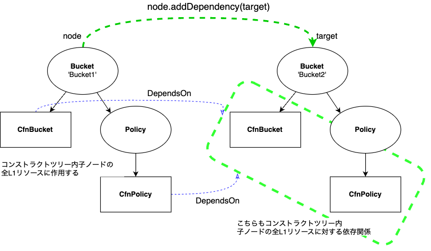
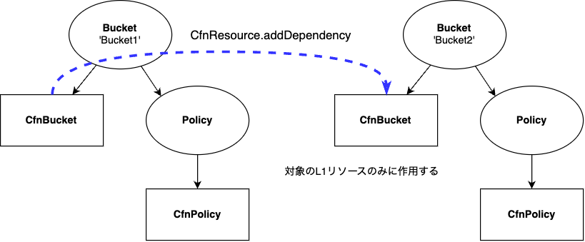

[AWS CDK Tipsの記事](https://tmokmss.hatenablog.com/entry/aws_cdk_tips)です。

CDKに `addDependency` メソッドが2種類あることをご存知でしたか？今日は2つの違いをお伝えします。

<!-- truncate -->

## addDependency とは
`addDependency` メソッドは、コンストラクト間の依存関係を明示的に指定するための機能です。AWS CDKにおいては、最終的にCloudFormationリソースの依存関係として扱われます。

これにより、CFnリソースの作成・更新・削除の順序を制御できるようになります。詳細はこちらのドキュメントもご覧ください: [DependsOn 属性](https://docs.aws.amazon.com/ja_jp/AWSCloudFormation/latest/UserGuide/aws-attribute-dependson.html)

ちなみにやや非自明なのですが、 `A.addDependency(B)` で、AがBに依存していることを意味します。つまり、Bが作成されたあとにAが作成され、またAが削除されたあとにBが削除されるなどの順番になります。

## 2種類の addDependency

CDKには2種類の `addDependency` メソッドがあります。まずはそれぞれの概要を紹介します:

### 1. Node.addDependency
`public addDependency(...deps: IDependable[]): void` [ドキュメント](https://docs.aws.amazon.com/cdk/api/v2/docs/constructs.Node.html#addwbrdependencydeps)


こちらは `constructs.Node` クラスに生えているメソッドです。CDKだと、以下のような使い方ができますね。

```ts

const bucket1 = new Bucket(stack, 'Bucket1');
const bucket2 = new Bucket(stack, 'Bucket2');

//bucket1はbucket2に依存する
bucket1.node.addDependency(bucket2);
```

引数の `IDependable` は全てのコンストラクトが実装するインターフェースのため、コンストラクトをそのまま渡すことができます。

### 2. CfnResource.addDependency
`public addDependency(target: CfnResource): void` [ドキュメント](https://docs.aws.amazon.com/cdk/api/v2/docs/aws-cdk-lib.CfnResource.html#addwbrdependencytarget)

一方こちらは `aws_cdk_lib.CfnResource` クラスに生えたメソッドです。使い方は以下です:

```ts
const bucket1Resource = bucket1.node.defaultChild;
const bucket2Resource = bucket2.node.defaultChild;
if (bucket1Resource && bucket2Resource &&
    CfnResource.isCfnResource(bucket1Resource) &&
    CfnResource.isCfnResource(bucket2Resource)
) {
    //bucket1はbucket2に依存する
    bucket1Resource.addDependency(bucket2Resource);
}

// 単純にこれでも可
const bucket1Resource = bucket1.node.defaultChild as CfnResource;
const bucket2Resource = bucket2.node.defaultChild as CfnResource;
bucket1Resource.addDependency(bucket2Resource);
```

こちらの引数は `CfnResource` のみです。

## で、何が違うの？
2つの違いを一言で表すなら、 **N対Nの依存関係か、1対1の依存関係か** と言えます。詳しく見ていきましょう。

`Node.addDependency(deps)` の場合は、そのノード (コンストラクト) の子(孫、ひ孫…)ノードに対して、再帰的に依存関係が追加されます。また、追加先のdepsについても、再帰的に処理されます。つまり、一度の操作でN対Nの依存関係を設定できます。

図解するとこのようです:



一方 `CfnResource.addDependency` の場合は、呼び出し元と引数の2つのL1コンストラクトのみに作用します。つまり、一度の操作で1対1の依存関係を設定できます。



コンストラクトツリーについてはこちらのドキュメントも読むと良いでしょう: [コンストラクト](https://docs.aws.amazon.com/ja_jp/cdk/v2/guide/constructs.html)

## 具体例
具体例として、CDKコードのその出力結果も見てみましょう。

`Node.addDependency` を用いたコードは以下です:

```ts
import * as cdk from 'aws-cdk-lib';
import { Bucket } from 'aws-cdk-lib/aws-s3';

const app = new cdk.App();

const stack = new cdk.Stack(app, 'SampleStack');
const bucket1 = new Bucket(stack, 'Bucket1', {
  removalPolicy: cdk.RemovalPolicy.DESTROY,
  autoDeleteObjects: true,
});
const bucket2 = new Bucket(stack, 'Bucket2', {
  removalPolicy: cdk.RemovalPolicy.DESTROY,
  autoDeleteObjects: true,
});
bucket1.node.addDependency(bucket2);
```

生成されるCloudFormationテンプレートは以下の通りです。`Bucket1` コンストラクト以下の全CFnリソースに、`Bucket2` コンストラクト以下の全CFnリソースに対する依存関係が追加されていることが分かります。

```json
{
 "Resources": {
  "Bucket12520700A": {
   "Type": "AWS::S3::Bucket",
   "Properties": {...},
   "DependsOn": [
    "Bucket2AutoDeleteObjectsCustomResourceF4462BA8",
    "Bucket2Policy945B22E3",
    "Bucket25524B414"
   ],
   "UpdateReplacePolicy": "Delete",
   "DeletionPolicy": "Delete",
   "Metadata": {
    "aws:cdk:path": "SampleStack/Bucket1/Resource"
   }
  },
  "Bucket1Policy65042C0B": {
   "Type": "AWS::S3::BucketPolicy",
   "Properties": {...},
   "DependsOn": [
    "Bucket2AutoDeleteObjectsCustomResourceF4462BA8",
    "Bucket2Policy945B22E3",
    "Bucket25524B414"
   ],
   "Metadata": {
    "aws:cdk:path": "SampleStack/Bucket1/Policy/Resource"
   }
  },
  "Bucket1AutoDeleteObjectsCustomResource41848F29": {
   "Type": "Custom::S3AutoDeleteObjects",
   "Properties": {...},
   "DependsOn": [
    "Bucket1Policy65042C0B",
    "Bucket2AutoDeleteObjectsCustomResourceF4462BA8",
    "Bucket2Policy945B22E3",
    "Bucket25524B414"
   ],
   "UpdateReplacePolicy": "Delete",
   "DeletionPolicy": "Delete",
   "Metadata": {
    "aws:cdk:path": "SampleStack/Bucket1/AutoDeleteObjectsCustomResource/Default"
   }
  },
  ...
 }
}
```

次に、`CfnResource.addDependency` を用いたコードは以下です:


```ts
import * as cdk from 'aws-cdk-lib';
import { Bucket } from 'aws-cdk-lib/aws-s3';

const app = new cdk.App();

const stack = new cdk.Stack(app, 'SampleStack');
const bucket1 = new Bucket(stack, 'Bucket1', {
  removalPolicy: cdk.RemovalPolicy.DESTROY,
  autoDeleteObjects: true,
});
const bucket2 = new Bucket(stack, 'Bucket2', {
  removalPolicy: cdk.RemovalPolicy.DESTROY,
  autoDeleteObjects: true,
});

const bucket1Resource = bucket1.node.defaultChild;
const bucket2Resource = bucket2.node.defaultChild;
if (bucket1Resource && bucket2Resource && 
    cdk.CfnResource.isCfnResource(bucket1Resource) && 
    cdk.CfnResource.isCfnResource(bucket2Resource)
) {
    bucket1Resource.addDependency(bucket2Resource);
}
```

合成結果は以下です。今度はBucket1とBucket2のL1コンストラクトのみに依存関係が追加されています。

```json
{
 "Resources": {
  "Bucket12520700A": {
   "Type": "AWS::S3::Bucket",
   "Properties": {...},
   "DependsOn": [
    "Bucket25524B414"
   ],
   "UpdateReplacePolicy": "Delete",
   "DeletionPolicy": "Delete",
   "Metadata": {
    "aws:cdk:path": "SampleStack/Bucket1/Resource"
   }
  },
 }
}
```

これで違いが分かりましたね！

## 落とし穴に注意！
N対NはN=1なら1対1と等しいんだから、 `CfnResource` の方は使いドコロある？と思う人もいるかもしれません。

確かにN=1にする、つまりツリーの末端・葉ノードに対して Node.addDependency を呼び出せば、1対1と同じことができます。

```ts
bucket1.node.defaultChild!.node.addDependency(bucket2.node.defaultChild!);
// これは↓と等価？
// bucket1Resource.addDependency(bucket2Resource);
```

しかし、この方法にはちょっとした落とし穴があります。コンストラクトツリーは開発者が任意のノードから子を追加できることに注意してください。
つまり、上のコードでは `bucket1.node.defaultChild!.node` は単一のCfnResource (CfnBucket) を指定することを意図していますが、この前提は容易に崩すことができます。

```ts
new CfnBucket(bucket1.node.defaultChild!, "UnexpectedBucket")
```

このようなノードが追加された場合、当初1対1の依存関係を意図していたところが、実は2対1になってしまうことになります。結果として意図せぬ循環依存が発生してしまうこともあるでしょう。

厳密に特定のCFnリソース間の依存関係を指定したい場合は、 `CfnResource.addDependency` の出番ということです。

## まとめ
CDKの豆知識を紹介しました。記事を書いたきっかけはAWS CDK本体の[こちらのPR](https://github.com/aws/aws-cdk/pull/27948)をレビューしたことです。慣れた開発者でも意図せぬバグを発生させうる挙動のため、注意して使い分けると良いでしょう。
