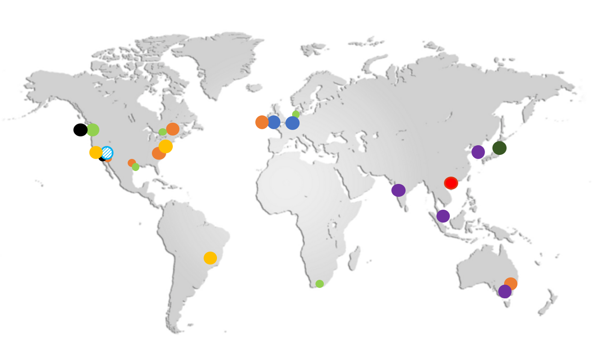
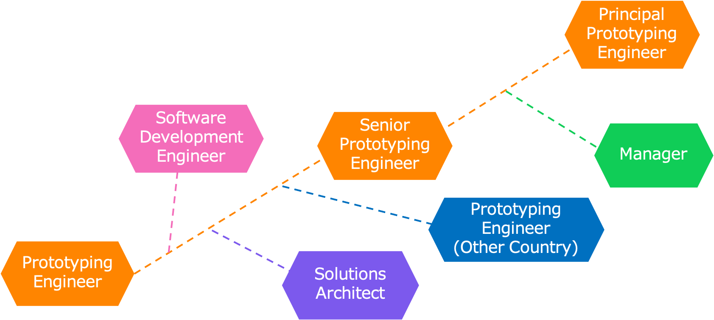

export const Section = ({children}) => (
    

        {children}
    

);

export const Center = ({children}) => (
    
        {children}
    
);

export const TextColor = ({children, color}) => (
    
        {children}
    
);

export const TextPrimary = ({children}) => (
    <TextColor color="#5882f7">{children}</TextColor>
);

export const Margin = ({children, margin}) => (
    

        {children}
    

);

<Section>

<Margin margin="10px 0 30px 0">

## Prototyping Engineer という仕事

</Margin>

<TextPrimary>

<Margin margin="0 0 20px 0">

### Solutions Architect (通称 SA)

</Margin>

</TextPrimary>

- カスタマーにとってのトラステッドアドバイザーとなり、技術的な課題の解決に貢献する
- 開発チームと連携し AWS サービスの改善や進化をサポートする
- 様々なイベントに登壇し、最新テクノロジーを啓蒙する
- ブログ記事やサンプルコードなど技術的なコンテンツを作成する

<TextPrimary>

<Margin margin="0 0 20px 0">

### Prototyping Engineer

</Margin>

</TextPrimary>

- Solutions Architect チームに所属し、Solutions Architect とともに活動する
- 特定のカスタマーのユースケースに沿ったプロトタイプを開発し、技術的な実現性を証明する
- 複数のカスタマーの共有課題を解決する技術アセットを開発し、社内外に広く展開する
- 開発の中で得られた知見を共有し、ベストプラクティスやアンチパターンの醸成に貢献する

</Section>

<Section>

## プロトタイプとは

<TextPrimary>

**_Envisioning the Art of the Possible_**

</TextPrimary>

特定のカスタマーのシステムを対象とし、限定された一部のユーザーストーリーの実現可能性を実証するシステム。最も検証が必要な内容に開発スコープを絞ることで、短期間で開発を完了させる。

</Section>

<Section>

## プロトタイプを開発する目的

<Margin margin="30px 0 20px 0">

<TextPrimary>

### カスタマーのメリット

</TextPrimary>

</Margin>

#### 1. 技術的なブロッカーの解決

新規制の高い技術領域を採用する場合や、パフォーマンス要件が厳しい場合などの状況下で、プロトタイプを開発して実現性を検証する。

#### 2. 開発ノウハウの拡充

今後のプロダクション開発に向けた土台を作り、第一歩を踏み出す。

<Margin margin="30px 0 20px 0">

<TextPrimary>

### AWS のメリット

</TextPrimary>

</Margin>

#### 1. AWS 採用の意思決定

AWS 上でシステムの実現可能性を示すことで、意思決定者から AWS の採用について賛同を得る。

#### 2. カスタマーの案件の加速

システムのリリースまでの期間を短縮することで、カスタマーのプロダクション移行を促進し、早期事例化を図る。

</Section>

<Section>

<Margin margin="0 0 30px 0">

## 開発プロセス

</Margin>

- **Phase 1. 要件のヒヤリング**
- **Phase 2. プロトタイプの開発**
- **Phase 3. プロトタイプの開発**
- **Phase 4. カスタマーへ引き渡し**
- **Phase 5. 一般化し社内外へ展開**

プロトタイプ開発は大きく 5 つのプロセスに分けて実施しています。
要件やアーキテクチャの確定にあたっては、ミーティングやコミュニケーションツールを活用してカスタマーと密に連携し、合意を得ます。
開発したプロトタイプが他のカスタマーでも有用と考えられる場合は、カスタマー固有の情報を除いたうえで社内外へ公開します。

</Section>

<Section>

## Prototyping Engineering チーム

<TextPrimary>

**_Work Globally_**

</TextPrimary>

Prototype Engineering を行うチームは世界中に存在します。
本人の希望次第で、他の国と共同で実施するプロジェクトのワーキンググループに参加することも可能です。

</Section>

<Section>

<Margin margin="0 0 30px 0">

## 期待される人物像

</Margin>

<TextPrimary>

**_Development x Your Competency_**

</TextPrimary>

カスタマーが実現したいプロトタイプの要件は、案件内容により様々です。だからこそ、開発経験を軸に多様なエンジニアが所属するチームでありたいと考えています。
一例として以下のようなバックグラウンドを持つメンバーが在籍しています。

- メガベンチャー企業出身のデベロッパー
- スタートアップ企業で活動したフルスタックエンジニア
- ゲーム業界の基盤を支えてきたシステムエンジニア

</Section>

<Section>

<Margin margin="0 0 30px 0">

## Prototyping Engineer のやりがい

</Margin>

ハッカソンのように短期間で目的の内容を開発することが好きな方、さまざまなテクノロジーに触れることが好きな方を募集しています。以下のような経験を積むことが可能です。

- AWS のサービスを無償で使い開発ができる。
- AWS に限らず多様なテクノロジーを経験することができる。
- 業種・業態を問わずカスタマーのビジネスに触れることができる。
- AWS Summit などの大規模なイベントで登壇経験を積むことができる。
- 英語を活用しグローバルに活躍する機会を得られる。

</Section>

<Section>

<Margin margin="0 0 30px 0">

## キャリアパス

</Margin>

AWS、Amazon には社内異動を積極的に行う文化があります。Prototyping Engineer としてキャリアアップを進めることも、その他のポジションを目指しステップアップすることも可能です。

</Section>

<Section>

<Margin margin="0 0 30px 0">

## WE'RE HIRING!

採用情報は[こちら](https://amazon.jobs/)から。

</Margin>

</Section>
